### 使用 BeanUtils.copyProperties 踩坑经历

>1. 原始转换

提起对象转换，每个程序员都不陌生，比如项目中经常涉及到的DO、DTO、VO之间的转换，举个例子，假设现在有个OrderDTO，定义如下所示：

```java
public class OrderDTO {
    private long id;

    private Long userId;

    private String orderNo;

    private Date gmtCreated;

    // 省略get、set方法
}
```

有个OrderVO，定义如下所示：

```java
public class OrderVO {
    private long id;

    private long userId;

    private String orderNo;

    private Date gmtCreated;
  
   // 省略get、set方法
}
```

如果不使用任何转换工具，代码是下面这样的：

```java
public static void main(String[] args) {
    OrderDTO orderDTO = new OrderDTO();
    orderDTO.setId(1L);
    orderDTO.setUserId(123L);
    orderDTO.setOrderNo("20210518000001");
    orderDTO.setGmtCreated(new Date());

    OrderVO orderVO = new OrderVO();
    orderVO.setId(orderDTO.getId());
    orderVO.setUserId(orderDTO.getUserId());
    orderVO.setOrderNo(orderDTO.getOrderNo());
    orderVO.setGmtCreated(orderDTO.getGmtCreated());

    System.out.println(orderVO.getId());
    System.out.println(orderVO.getUserId());
    System.out.println(orderVO.getOrderNo());
    System.out.println(orderVO.getGmtCreated());
}
```

运行结果：

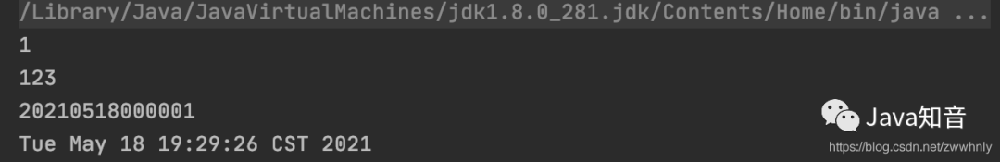

>2. 使用BeanUtils.copyProperties转换

因为项目中类似上面的转换多而繁琐，所以很多公司的项目中会使用Spring框架里的`BeanUtils.copyProperties`来做对象转换，代码如下所示：

```java
OrderVO orderVO = new OrderVO();
BeanUtils.copyProperties(orderDTO, orderVO);
```

一行代码搞定，很方便，运行结果也和原来一模一样。

不过这个工具带来便利的同时，也带来了很多问题，稍微不注意就会踩坑，接下来就总结下使用这个工具常见的几个坑。

>3. 踩坑经历

3.1 包装类型转基本类型问题

```java
java.lang.IllegalArgumentException
```

细心的你可能会发现，OrderDTO中的userId字段，我定义的是Long类型：

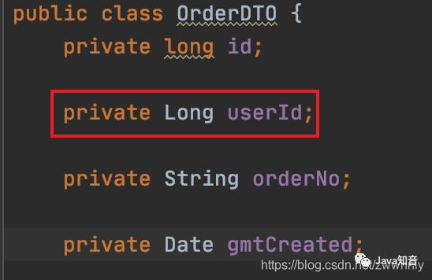

而OrderVO中的userId字段，我定义的是long类型：

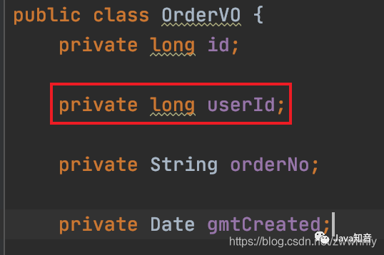

然后我们运行下下面所示的代码：

```java
public static void main(String[] args) {
    OrderDTO orderDTO = new OrderDTO();
    orderDTO.setId(1L);
    orderDTO.setUserId(null);
    orderDTO.setOrderNo("20210518000001");
    orderDTO.setGmtCreated(new Date());

    OrderVO orderVO = new OrderVO();
    BeanUtils.copyProperties(orderDTO, orderVO);
}
```

会看到代码抛了`java.lang.IllegalArgumentException`异常：

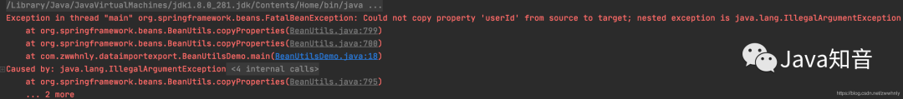

>3.2 空格问题

假设OrderVO的orderNo字段，是用户自定义的，用户不小心输入了空格，使用`BeanUtils.copyProperties`后，空格会带入到OrderDTO的orderNo字段，如果不小心，就会把脏数据落到数据库（而我们希望的是去除空格再落库的），造成一系列后续问题：

```java
public static void main(String[] args) {
    OrderVO orderVO = new OrderVO();
    orderVO.setId(1L);
    orderVO.setUserId(123L);
    // 模拟空格场景
    orderVO.setOrderNo(" 20210518000001 ");
    orderVO.setGmtCreated(new Date());

    OrderDTO orderDTO = new OrderDTO();
    BeanUtils.copyProperties(orderVO, orderDTO);

    System.out.println(orderDTO.getOrderNo());
}
```

运行结果：

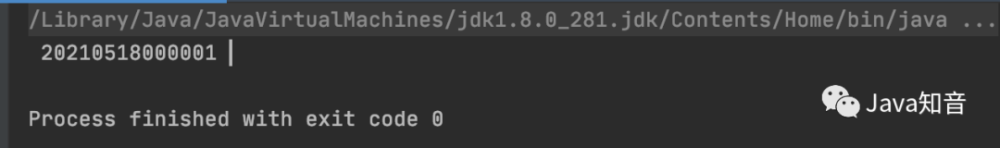

>3.3 查找不到字段引用

使用`BeanUtils.copyProperties`后，会看到字段并没有引用，其实是有用到的，如下图所示：

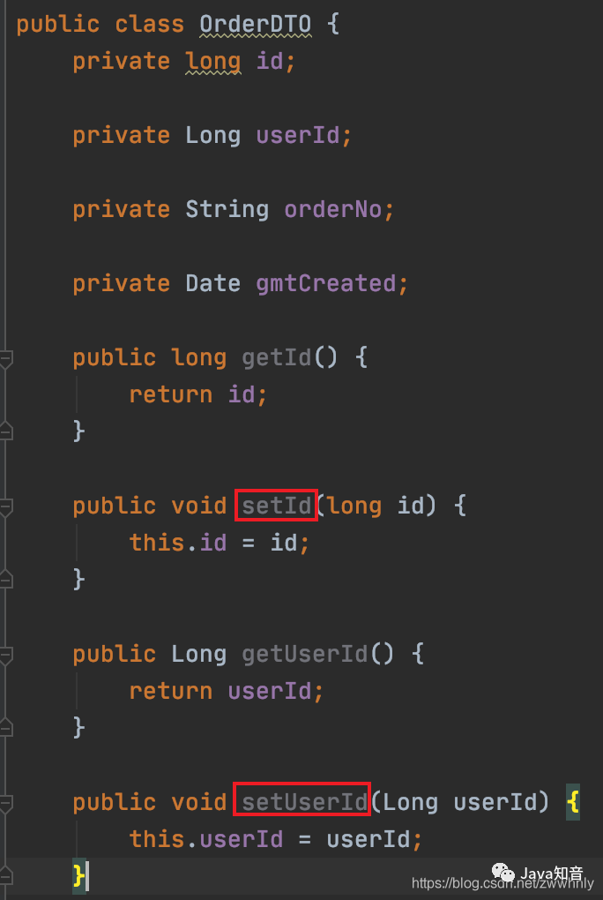

有些小伙伴在看代码时，看到字段没有地方引用，可能就忍不住想删掉，结果就导致真正使用该字段的地方取不到值，产生bug。

>3.4 前端误传字段，直接把数据库覆盖了

如果接口定义的比较严谨，理论上是不应该存在这种情况的，不过凡事总有特殊，这里举个接口不严谨导致数据被覆盖的例子。

假如OrderVO和OrderDTO有如下2个字段：

```java
/**
 * 已收金额
 * 单位：分
 */
private Long receivedAmount;

/**
 * 备注
 */
private String remark;
```

正常情况下，后端只应该使用前端传递的remark字段，`receivedAmount`字段不应该使用，但假如用户修改订单备注时，前端不小心传递了`receivedAmount`字段，并且赋值为null，这时使用`BeanUtils.copyProperties`后，OrderDTO里的`receivedAmount`字段就也为null，如果后端不知道前端传递了这个字段并且操作DB不够严谨，就会导致订单的已收金额被清空，很恐怖，而且不好排查原因。

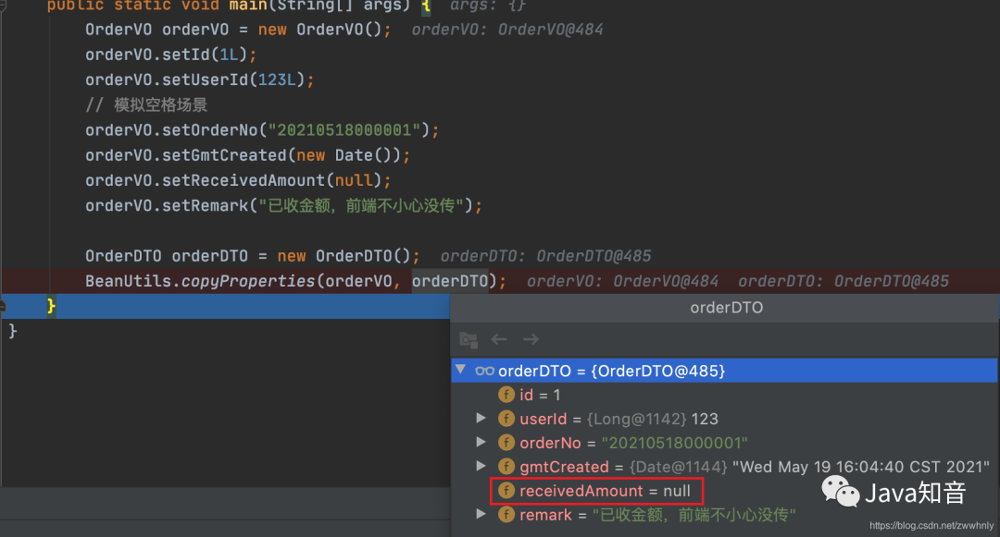

>4. 插件推荐

虽然`BeanUtils.copyProperties`工具提供了便利，但带来的问题也很多，因此很多公司（包含我现在所在的公司）都禁止在项目中使用该工具。

但重复的写对象转换，实在是太繁琐，效率太低了，这里推荐一个IDEA的插件`GenerateAllSetter`，可以一键生成对象的set方法，非常方便，如下图所示：

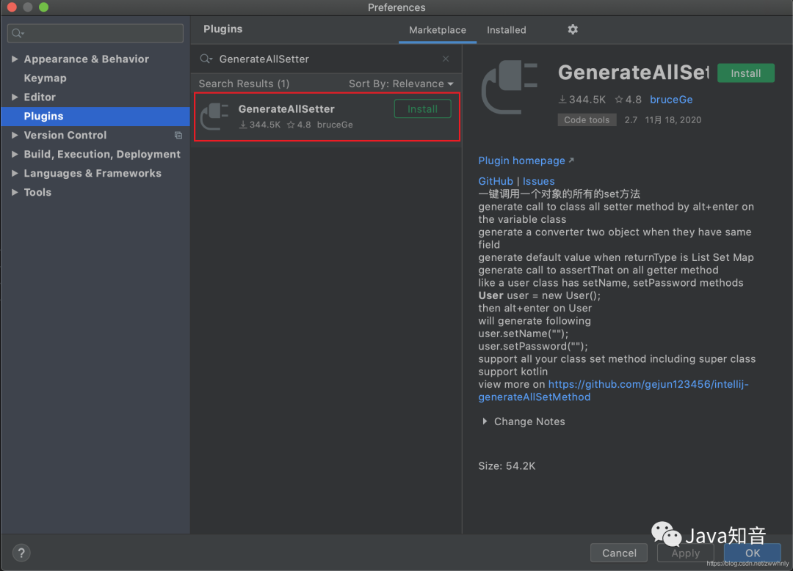

插件使用：

在需要生成set方法的对象上，按快捷键`Option+Enter`（Windows是`Alt+Enter`），会看到下图所示的选项：

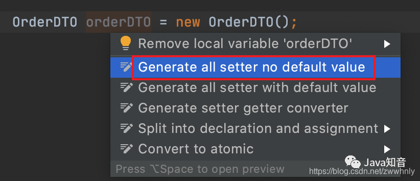

点击后会自动生成所有字段（没有默认值）的赋值语句：

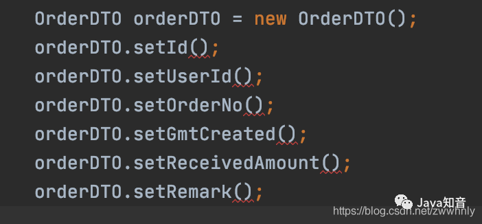

如果生成赋值语句时想带默认值，可以使用另一个选项：

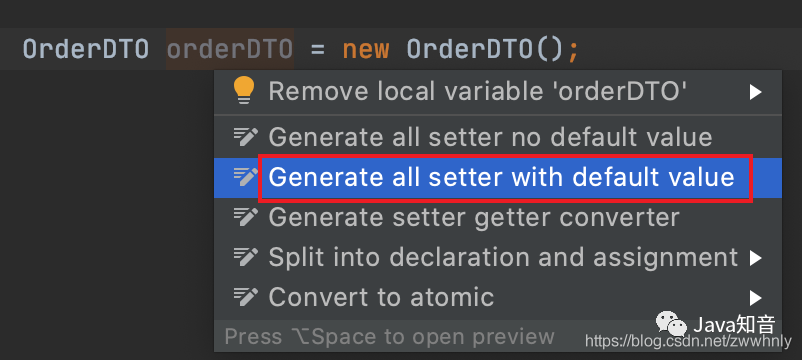

效果如下所示：

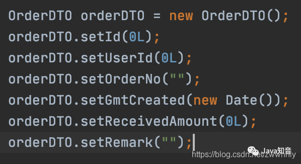