>**第一步、了解SpringTask**

​	在实际开发中, 根据业务需求, 我们经常需要处理一些定时任务, 例如:每天凌晨备份一下数据, 每月清空一次日志, 页面广告一周之后过期, 每三个月清空一下cookie等等。目前最常见的实现定时任务的方式有三种:

- Java自带的java.util.Timer类，这个类允许你调度一个java.util.TimerTask任务。使用这种方式可以让程序按照某一个频度或间隔运行，但不能在指定时间运行, 一般用的较少。
- 使用Quartz，这是一个功能比较强大的的开源工具，可以让程序在指定时间运行，也可以按照某一个频度或间隔运行，配置起来稍显复杂。

- Spring 3.0以后自带task调度工具，可以将它看成一个轻量级的Quartz，而且使用起来比Quartz更加简单方便, 我们这里重点讲解这种方式。

**SpringTask默认不支持分布式**

​		**Spring Task** 并不是为分布式环境设计的，在分布式环境下，这种定时任务是不支持集群配置的，如果部署到多个节点上，各个节点之间并没有任何协调通讯机制，集群的节点之间是不会共享任务信息的，每个节点上的任务都会按时执行，导致任务的重复执行。我们可以使用支持分布式的定时任务调度框架，比如 **Quartz、XXL-Job、Elastic Job**。当然你可以借助 **zookeeper、redis** 等实现分布式锁来处理各个节点的协调问题。或者把所有的定时任务抽成单独的服务单独部署。

>**第二步、spring框架进行定时任务开发**

使用spring框架进行定时任务开发, 无非就是两种方式: 纯XML配置方式和全注解方式, 接下来我们会分别介绍这两种方式。


Spring Task的主要API存在于spring-context包中, 引入后的效果如下图所示:

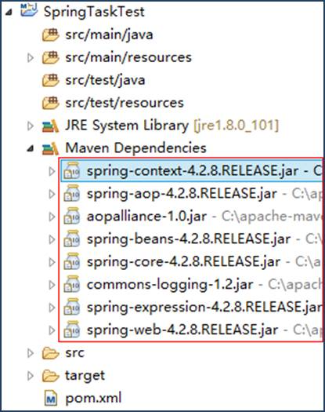

这是进行Spring Task开发所需的最少,最基本的jar包, 注意: spring必须是3.0以上的版本。

要使用spring进行开发需要在web.xml中进行spring监听器的配置, 如下图所示:

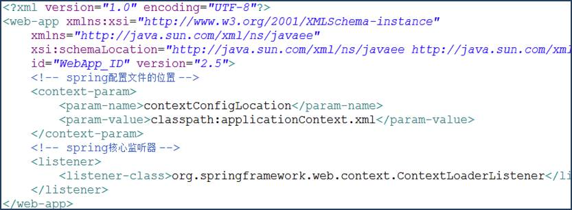

该配置可以保证启动服务器时去解析spring配置文件,并加载spring容器

**2.1 纯XML配置方式**

**2.1.1 简单定时任务**

定时任务中的业务功能我们按照常规的处理方式放到业务层实现, 所以首先编写一个业务层接口TaskService, 如下图所示:

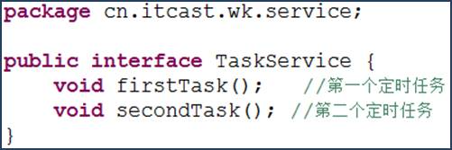

接下来编写该接口的实现类TaskServiceImpl, 在该类中实现两个定时任务, 业务功能上做了简化处理, 只是往控制台输出一句话, 如下图所示:

两个定时任务中的业务功能已经实现, 接下来如何运行这两个定时任务呢? 我们需要在applicationContext.xml中进行配置, 如下图所示:

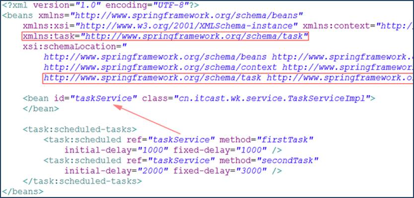

l 由于我们需要使用task标签,所以需要在配置文件的头部引入task的命名空间和xsd文件

l 每个定时任务用标签定义,中可以包含多个定时任务, 这些定时任务不分先后顺序

l 标签的各个属性：

​		ref属性用来设置一个bean对象,

​		method属性用来设置bean对象中的某个方法名

​		initial-delay属性用来设置当tomcat启动完毕后延迟多少毫秒开始运行定时任务

​		fixed-delay属性用来设置每隔多少毫秒运行一次定时任务,即定时任务的频率或间隔,

​		注意：initial-delay和fixed-delay属性只有在spring 3.2以上版本才有效

我们在spring配置文件中定义了两个任务, 第一个任务在tomcat启动完毕后延迟1秒钟开始运行,之后每隔1秒运行一次; 第二个任务在tomcat启动完毕后延迟2秒钟开始运行,之后每隔3秒运行一次, 具体效果如下图所示:

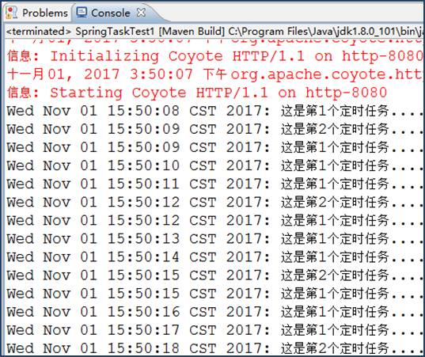

**2.1.2 复杂定时任务**

上面我们演示的是最简单的定时任务,这种任务有着固定的频率或间隔, 当然在实际开发中我们也会碰到定时规则比较复杂的情况, 这时候我们就需要用到强大的cron表达式了。

cron表达式是一个字符串, 用来定义复杂的定时规则, 由七部分组成, 每部分中间用空格隔开, 每部分的含义如下表所示:

| 组成部分 | 含义              | 取值范围                  |
| -------- | ----------------- | ------------------------- |
| 第一部分 | Seconds (秒)      | 0－59                     |
| 第二部分 | Minutes(分)       | 0－59                     |
| 第三部分 | Hours(时)         | 0-23                      |
| 第四部分 | Day-of-Month(天)  | 1-31                      |
| 第五部分 | Month(月)         | 0-11或JAN-DEC             |
| 第六部分 | Day-of-Week(星期) | 1-7(1表示星期日)或SUN-SAT |
| 第七部分 | Year(年) 可选     | 1970-2099                 |

cron表达式还可以包含一些特殊符号来定义更加灵活的定时规则, 如下表所示:

| 符号 | 含义                                                         |
| ---- | ------------------------------------------------------------ |
| ?    | 表示不确定的值,任意的一天                                    |
| *    | 表示整个时间段                                               |
| ,    | 设置多个值,例如”26,29,33”表示在26分,29分和33分各自运行一次任务 |
| -    | 设置取值范围,例如”5-20”，表示从5分到20分钟每分钟运行一次任务 |
| /    | 设置频率或间隔,如"1/15"表示从1分开始,每隔15分钟运行一次任务  |
| L    | 用于每月，或每周，表示每月的最后一天，或每个月的最后星期几,例如"6L"表示"每月的最后一个星期五" |
| W    | 表示离给定日期最近的工作日,例如"15W"放在每月（day-of-month）上表示"离本月15日最近的工作日" |
| #    | 表示该月第几个周X。例如”6#3”表示该月第3个周五                |

为了让大家更熟悉cron表达式的用法, 接下来我们给大家列举了大量的例子, 如下表所示:

| cron表达式           | 含义                                      |
| -------------------- | ----------------------------------------- |
| */5 * * * * ?        | 每隔5秒运行一次任务                       |
| 0 0 23 * * ?         | 每天23点运行一次任务                      |
| 0 0 1 1 * ?          | 每月1号凌晨1点运行一次任务                |
| 0 0 23 L * ?         | 每月最后一天23点运行一次任务              |
| 0 26,29,33 * * * ?   | 在26分、29分、33分运行一次任务            |
| 0 0 0,13,18,21 * * ? | 每天的0点、13点、18点、21点都运行一次任务 |
| 0 0/30 9-17 * * ?    | 朝九晚五工作时间内每半小时运行一次任务    |
| 0 15 10 ? * 6#3      | 每月的第三个星期五上午10:15运行一次任务   |

接下来我们给上面例子中的两个任务分别设置两个不同的cron表达式, 第一个任务每隔5秒钟运行一次, 第二个任务是在每天的15:45运行一次, 如下图所示:

其他地方的代码不做任何修改, 运行效果如下图所示:

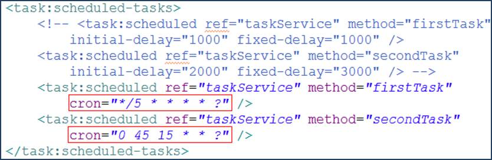

其他地方的代码不做任何修改, 运行效果如下图所示:

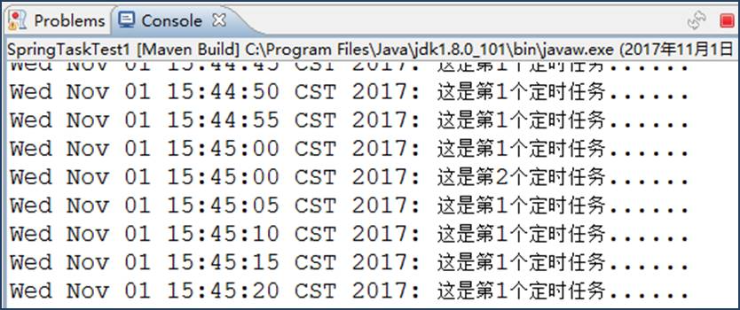

**3.2 全注解方式**

​		除了采用XML配置的方式可以实现定时任务之外, spring也支持全注解的方式来实现定时任务。 为了跟上面的例子区分开, 接下来我们单独再创建一个项目SpringTaskTest2来演示。 创建项目并导入Jar包, 以及配置web.xml的过程跟上面的例子一模一样, 这里不再演示。

​	我们可以直接在业务层的实现类中使用@Service注解, 该注解用到类上表示该类的对象由spring负责创建和管理, 等价于applicationContext.xml中的配置, @Scheduled注解用到方法上用于设置定时规则, 等价于applicationContext.xml中的配置, 具体代码如下图所示:


当然, 要想让这些注解起作用, 我们还必须在applicationContext.xml中做如下配置:

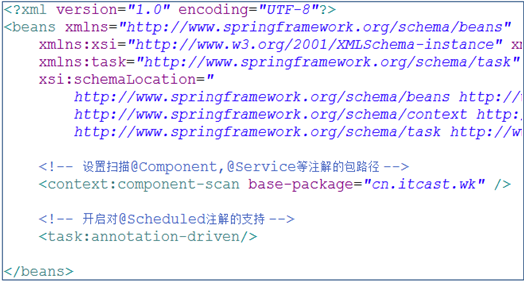

项目运行效果如下图所示:

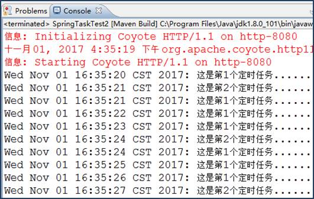

@Scheduled注解也支持cron表达式, 接下来我们修改一下实现类中的代码, 让第一个任务每隔5秒钟运行一次, 第二个任务在每天的16:45运行一次, 如下图所示:

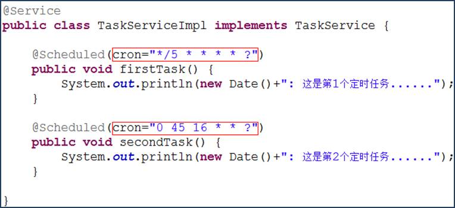

项目运行效果如下图所示:

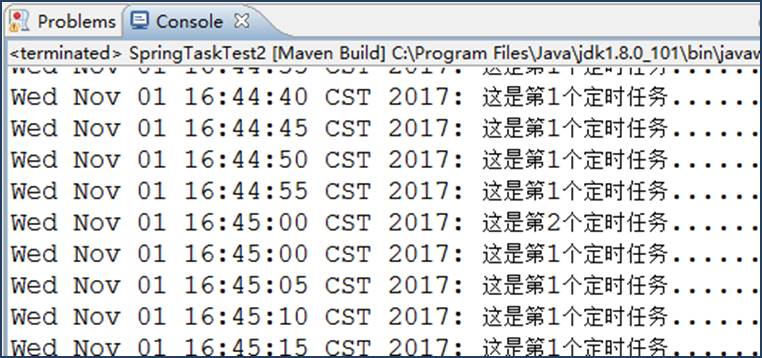


>**第三步、在Spring Boot中实现定时任务**

**第一步、开启注解** **@EnableScheduling**

​		Spring Boot 默认在无任何第三方依赖的情况下使用 spring-context 模块下提供的定时任务工具 **Spring Task**。我们只需要使用 @EnableScheduling 注解就可以开启相关的定时任务功能。

```java
@EnableScheduling  
@SpringBootApplication
public class SpringTaskApplication {
    public static void main(String[] args) {
        SpringApplication.run(SpringTaskApplication.class, args);
    }
}
```

然后我们就可以通过注解的方式实现自定义定时任务。

**第二步、定义定时任务逻辑方法并使用 @Scheduled 标记**

@Scheduled 注解中一定要声明定时任务的执行策略 cron 、fixedDelay、fixedRate 三选一

```java
@Service
public class TaskServiceImpl {

    @Scheduled(initialDelay = 1000,fixedRate = 2000)
    public Date showMessage(){
        Date date = new Date();
        System.out.println(date);
        return date;
    }
}
```

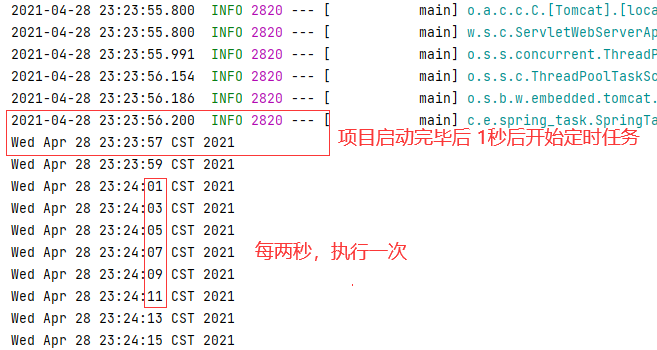

**注解详解**

**总体把握注解**

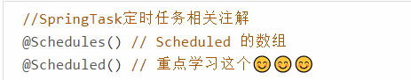

Schedules注解

```java
@Target({ElementType.METHOD, ElementType.ANNOTATION_TYPE})
@Retention(RetentionPolicy.RUNTIME)
@Documented
public @interface Schedules {
    Scheduled[] value();
}
```

Scheduled注解

单词普及

DISABLED 已停用、fixed 固定的、Delay 延迟、Rate 比例

```java
@Target({ElementType.METHOD, ElementType.ANNOTATION_TYPE})
@Retention(RetentionPolicy.RUNTIME)
@Documented
@Repeatable(Schedules.class)
public @interface Scheduled {
    String CRON_DISABLED = "-";

    String cron() default "";

    String zone() default "";

    long fixedDelay() default -1L;  // 单位 ms   任务结束后，等待几秒隔执行一次任务

    String fixedDelayString() default "";

    long fixedRate() default -1L;  单位 ms   每隔几秒隔执行一次任务

    String fixedRateString() default "";

    long initialDelay() default -1L;  // 项目启动后几秒后开始执行定时任务

    String initialDelayString() default "";
}
```

@Scheduled 注解中一定要声明定时任务的执行策略 cron 、fixedDelay、fixedRate 三选一

**注解属性详情**

**initialDelay**

- **initialDelay** 初始化延迟时间，也就是第一次延迟执行的时间。这个参数对 cron 属性无效，只能配合 fixedDelay 或 fixedRate 使用。如 @Scheduled(initialDelay=5000,fixedDelay = 1000) 表示第一次延迟 5000 毫秒执行，下一次任务在上一次任务结束后 1000 毫秒后执行。

**fixedDelay**

- **fixedDelay**。它的间隔时间是根据上次的任务结束的时候开始计时的，只要盯紧上一次执行结束的时间即可，跟任务逻辑的执行时间无关，两个轮次的间隔距离是固定的。（个人理解：任务结束开始计时）

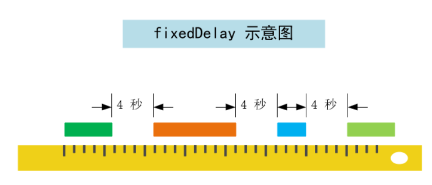

**fixedRate （难）**

- **fixedRate**。这个相对难以理解一些。在理想情况下，下一次开始和上一次开始之间的时间间隔是一定的。**但是默认情况下 Spring Boot 定时任务是单线程执行的**。当下一轮的任务满足时间策略后任务就会加入队列，也就是说当本次任务开始执行时下一次任务的时间就已经确定了，由于本次任务的“超时”执行，下一次任务的等待时间就会被压缩甚至阻塞，算了画张图就明白了

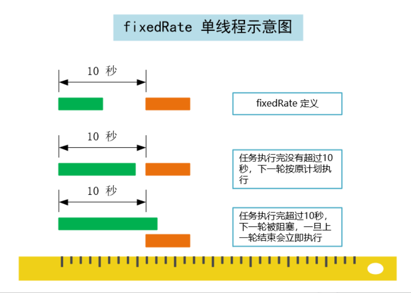

**cron 表达式（相对复杂）**

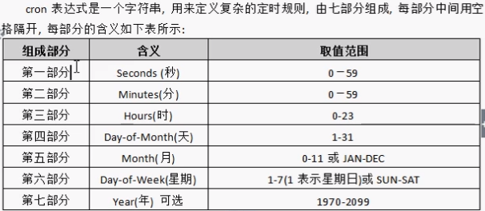

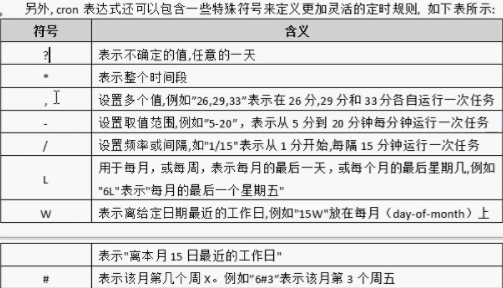

- L: 表示最后，只能出现在DayofWeek和DayofMonth域，如果在DayofWeek域使用5L,意味着在最后的一个星期四触发。
- W: 表示有效工作日(周一到周五),只能出现在DayofMonth域，系统将在离指定日期的最近的有效工作日触发事件。例如：在 DayofMonth使用5W，如果5日是星期六，则将在最近的工作日：星期五，即4日触发。如果5日是星期天，则在6日(周一)触发；如果5日在星期一 到星期五中的一天，则就在5日触发。另外一点，W的最近寻找不会跨过月份

- LW: 这两个字符可以连用，表示在某个月最后一个工作日，即最后一个星期五。
- \#: 用于确定每个月第几个星期几，只能出现在DayofMonth域。例如在4#2，表示某月的第二个星期三。

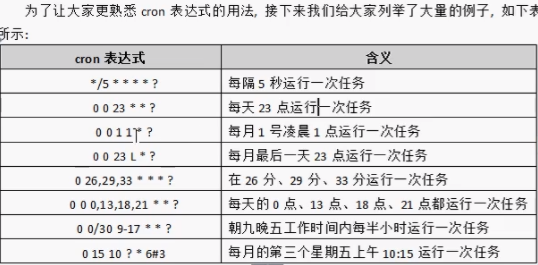

使用工具生成cron表达式

https://www.bejson.com/othertools/cron/

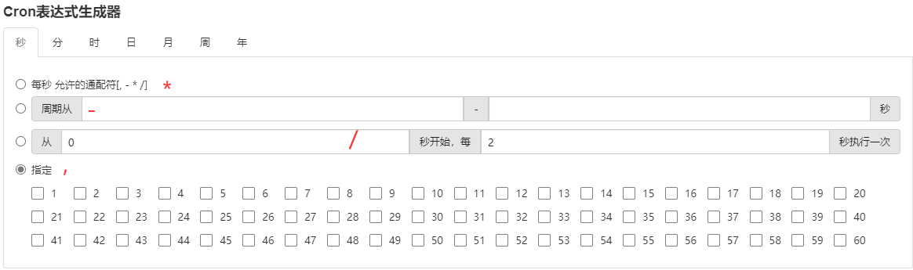

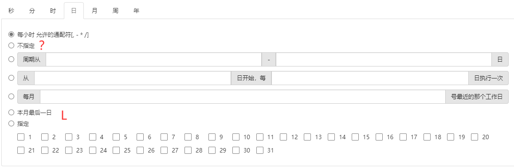

**第三步、单线程多任务的问题（超级难）**

```java
@Service
public class TaskServiceImpl {
    /**
     * 上一次任务结束后 1 秒，执行下一次任务，任务消耗 5秒
     *
     * @throws InterruptedException the interrupted exception
     */
    @Scheduled(fixedDelay = 1000)
    public void task() throws InterruptedException {
        System.out.println("Thread Name : "
                + Thread.currentThread().getName()
                + "  i am a task : date ->  "
                + LocalDateTime.now().format( DateTimeFormatter.ofPattern("yyyy-MM-dd HH:mm:ss")));
        Thread.sleep(5000);
    }

    /**
     * 下轮任务在本轮任务开始2秒后执行. 执行时间可忽略不计
     */
    @Scheduled(fixedRate = 2000)
    public void task2() {
        System.out.println("Thread Name : "
                + Thread.currentThread().getName()
                + "  i am a task2 : date ->  "
                + LocalDateTime.now().format(DateTimeFormatter.ofPattern("yyyy-MM-dd HH:mm:ss")));
    }

}
```

上面定义了两个定时任务（策略参见注释），运行结果如下：


由于是单线程，当线程1堵塞了，线程2无法正常工作导致积压.....

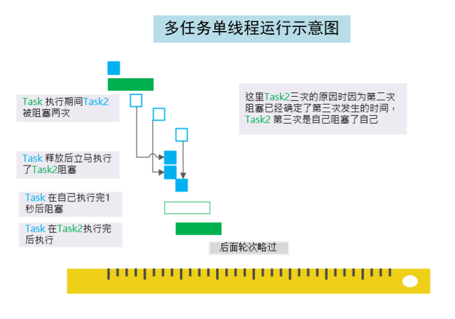

也就是说因为单线程阻塞发生了“连锁反应”，导致了任务执行的错乱。我们就需要改造定时任务的机制。@EnableScheduling 注解引入了 ScheduledAnnotationBeanPostProcessor 其 setScheduler(Object scheduler) 有以下的注释：

如果 TaskScheduler 或者 ScheduledExecutorService 没有定义为该方法的参数，该方法将在 Spring IoC 中寻找唯一的 TaskScheduler 或者 名称为 taskScheduler 的 **Bean** 作为参数，当然你按照查找 TaskScheduler 的方法找一个ScheduledExecutorService 也可以。要是都找不到那么只能使用本地单线程调度器了。

在springboot默认的线程池中，是单一线程。所以默认情况下，所有Scheduled不能并发执行。解决方法都是自定义一个线程池

[SpringBoot，设置并发执行定时任务Scheduled（分析EnableScheduling ，ScheduledAnnotationBeanPostProcessor）](https://blog.csdn.net/a718515028/article/details/80396102)有能力的话多看看分析🤢🤢

```java
/**
 * 解决单一线程问题，单线程多任务
 */
@Configuration
public class MySchedulingConfig implements SchedulingConfigurer {
    @Override
    public void configureTasks(ScheduledTaskRegistrar scheduledTaskRegistrar) {
        scheduledTaskRegistrar.setScheduler(TaskScheduler());
    }
    @Bean
    public Executor TaskScheduler() {
        return Executors.newScheduledThreadPool(10);
    }
}
```

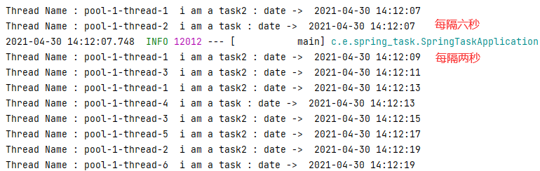

扩展-->异步方式：[来源CSDN](https://blog.csdn.net/dhq_blog/article/details/90511425)

逃不过线程池

```java
@Configuration
@EnableAsync  // 😊😊关注点
public class AsyncConfig {
    /*
     此处成员变量应该使用@Value从配置中读取
    */
    private int corePoolSize = 10;
    private int maxPoolSize = 200;
    private int queueCapacity = 10;

    @Bean
    public Executor taskExecutor() {
        ThreadPoolTaskExecutor executor = new ThreadPoolTaskExecutor();
        executor.setCorePoolSize(corePoolSize);
        executor.setMaxPoolSize(maxPoolSize);
        executor.setQueueCapacity(queueCapacity);
        executor.initialize();
        return executor;
    }
}
```

```java
@Service
public class TaskServiceImpl2 {
    
    @Async  // 😊 关注点 作为扩展知识需要去了解，去学习
    @Scheduled(fixedDelay = 1000)
    public void task() throws InterruptedException {
        System.out.println("Thread Name : "
                + Thread.currentThread().getName()
                + "  i am a task : date ->  "
                + LocalDateTime.now().format( DateTimeFormatter.ofPattern("yyyy-MM-dd HH:mm:ss")));
        Thread.sleep(5000);  // 失效了？？？？？？
    }
    
    @Async
    @Scheduled(fixedRate = 2000)
    public void task2() {
        System.out.println("Thread Name : "
                + Thread.currentThread().getName()
                + "  i am a task2 : date ->  "
                + LocalDateTime.now().format(DateTimeFormatter.ofPattern("yyyy-MM-dd HH:mm:ss")));
    }
}
```

sleep失效了？为什么？？

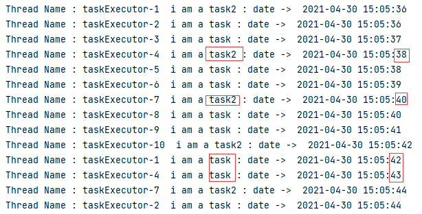

**Spring Task** 的调用顺序关系为：**任务调度线程** 调度 **任务执行线程** 执行 **定时任务** 所以我们按照上面定义一个 TaskScheduler 在 **Spring Boot** 自动配置中提供了 TaskScheduler 的自动配置：

源码

```java
@ConditionalOnClass({ThreadPoolTaskScheduler.class})
@Configuration(
    proxyBeanMethods = false
)
@EnableConfigurationProperties({TaskSchedulingProperties.class})
@AutoConfigureAfter({TaskExecutionAutoConfiguration.class})
public class TaskSchedulingAutoConfiguration {
    public TaskSchedulingAutoConfiguration() {
    }

    @Bean
    @ConditionalOnBean(
        name = {"org.springframework.context.annotation.internalScheduledAnnotationProcessor"}
    )
    @ConditionalOnMissingBean({SchedulingConfigurer.class, TaskScheduler.class, ScheduledExecutorService.class})
    public ThreadPoolTaskScheduler taskScheduler(TaskSchedulerBuilder builder) {
        return builder.build();
    }

    @Bean
    @ConditionalOnMissingBean
    public TaskSchedulerBuilder taskSchedulerBuilder(TaskSchedulingProperties properties, ObjectProvider<TaskSchedulerCustomizer> taskSchedulerCustomizers) {
        TaskSchedulerBuilder builder = new TaskSchedulerBuilder();
        builder = builder.poolSize(properties.getPool().getSize());
        Shutdown shutdown = properties.getShutdown();
        builder = builder.awaitTermination(shutdown.isAwaitTermination());
        builder = builder.awaitTerminationPeriod(shutdown.getAwaitTerminationPeriod());
        builder = builder.threadNamePrefix(properties.getThreadNamePrefix());
        builder = builder.customizers(taskSchedulerCustomizers);
        return builder;
    }
}
```

该配置的自定义配置以 spring.task.scheduling 开头。同时它需要在任务执行器配置 TaskExecutionAutoConfiguration 配置后才生效。我们只需要在中对其配置属性 spring.task.execution 相关属性配置即可。

**Spring Boot** 的 application.properties 中相关的配置说明：

```properties
# 任务调度线程池

# 任务调度线程池大小 默认 1 建议根据任务加大
spring.task.scheduling.pool.size=1
# 调度线程名称前缀 默认 scheduling-
spring.task.scheduling.thread-name-prefix=scheduling-
# 线程池关闭时等待所有任务完成
spring.task.scheduling.shutdown.await-termination=
# 调度线程关闭前最大等待时间，确保最后一定关闭
spring.task.scheduling.shutdown.await-termination-period=


# 任务执行线程池配置

# 是否允许核心线程超时。这样可以动态增加和缩小线程池
spring.task.execution.pool.allow-core-thread-timeout=true
#  核心线程池大小 默认 8
spring.task.execution.pool.core-size=8
# 线程空闲等待时间 默认 60s
spring.task.execution.pool.keep-alive=60s
# 线程池最大数  根据任务定制
spring.task.execution.pool.max-size=
#  线程池 队列容量大小
spring.task.execution.pool.queue-capacity=
# 线程池关闭时等待所有任务完成
spring.task.execution.shutdown.await-termination=true
# 执行线程关闭前最大等待时间，确保最后一定关闭
spring.task.execution.shutdown.await-termination-period=
# 线程名称前缀
spring.task.execution.thread-name-prefix=task-
```

配置完后你就会发现定时任务可以并行异步执行了。