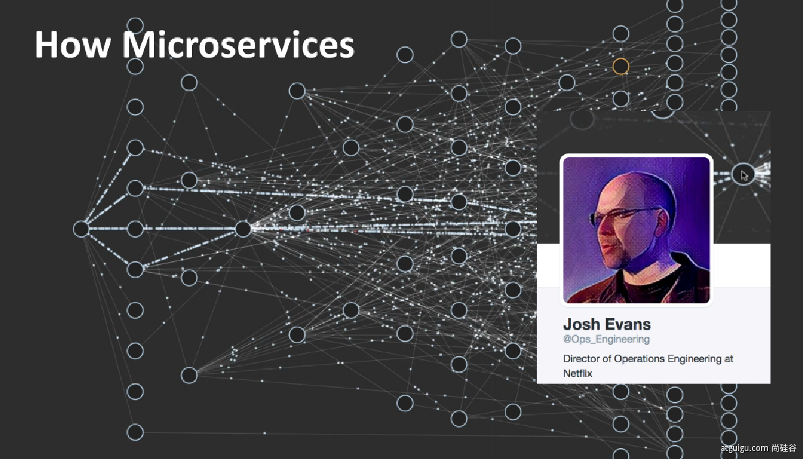

### $\textcolor{ProcessBlue}{一、Spring能做什么} $

>1.1、Spring的能力

>1.2、Spring的生态

https://spring.io/projects/spring-boot

覆盖了：

web开发		数据访问		安全控制		分布式		消息服务		移动开发	批处理		......

>1.3、Spring5重大升级

1.3.1、响应式编程

**1.3.2、内部源码设计**

基于Java8的一些新特性，如：接口默认实现。重新设计源码架构。

### $\textcolor{ProcessBlue}{二、为什么用SpringBoot} $

Spring Boot makes it easy to create stand-alone, production-grade Spring based Applications that you can "just run".

能快速创建出生产级别的Spring应用

>2.1、SpringBoot优点

- Create stand-alone Spring applications

- - 创建独立Spring应用

- Embed Tomcat, Jetty or Undertow directly (no need to deploy WAR files)

- - 内嵌web服务器

- Provide opinionated 'starter' dependencies to simplify your build configuration

- - 自动starter依赖，简化构建配置

- Automatically configure Spring and 3rd party libraries whenever possible

- - 自动配置Spring以及第三方功能

- Provide production-ready features such as metrics, health checks, and externalized configuration

- - 提供生产级别的监控、健康检查及外部化配置

- Absolutely no code generation and no requirement for XML configuration

- - 无代码生成、无需编写XML

- 

- SpringBoot是整合Spring技术栈的一站式框架

- SpringBoot是简化Spring技术栈的快速开发脚手架

>SpringBoot缺点

- 人称版本帝，迭代快，需要时刻关注变化
- 封装太深，内部原理复杂，不容易精通

### $\textcolor{ProcessBlue}{三、时代背景} $

>3.1、微服务

[James Lewis and Martin Fowler (2014)](https://martinfowler.com/articles/microservices.html)  提出微服务完整概念。

- 微服务是一种架构风格
- 一个应用拆分为一组小型服务
- 每个服务运行在自己的进程内，也就是可独立部署和升级
- 服务之间使用轻量级HTTP交互
- 服务围绕业务功能拆分
- 可以由全自动部署机制独立部署
- 去中心化，服务自治。服务可以使用不同的语言、不同的存储技术

>分布式

**分布式的困难**

- 远程调用
- 服务发现
- 负载均衡
- 服务容错
- 配置管理
- 服务监控
- 链路追踪
- 日志管理
- 任务调度
- ......

> 3.3、云原生

原生应用如何上云。 Cloud Native

**上云的困难**

- 服务自愈
- 弹性伸缩
- 服务隔离
- 自动化部署
- 灰度发布
- 流量治理
- ......

### $\textcolor{ProcessBlue}{四、如何学习SpringBoot} $

