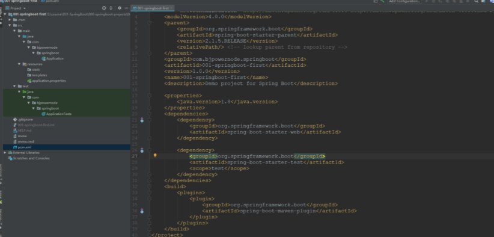

$\textcolor{ProcessBlue}{一、Spring Boot 简介 } $

​		Spring Boot 是 Spring 家族中的一个全新的框架，它用来简化 Spring 应用程序的创建和 开发过程，也可以说 Spring Boot 能简化我们之前采用 SpringMVC + Spring + MyBatis 框架进行 开发的过程。 在以往我们采用 SpringMVC + Spring + MyBatis 框架进行开发的时候，搭建和整合三大框 架，我们需要做很多工作，比如配置 web.xml，配置 Spring，配置 MyBatis，并将它们整合在 一起等，而 Spring Boot 框架对此开发过程进行了革命性的颠覆，完全抛弃了繁琐的 xml 配 置过程，采用大量的默认配置简化我们的开发过程。 所以采用 Spring Boot 可以非常容易和快速地创建基于 Spring 框架的应用程序，它让编 码变简单了，配置变简单了，部署变简单了，监控变简单了。正因为 Spring Boot 它化繁为 简，让开发变得极其简单和快速，所以在业界备受关注。

### $\textcolor{ProcessBlue}{二、Spring Boot 的特性} $

 ➢ 能够快速创建基于 Spring 的应用程序 

➢ 能够直接使用 java main 方法启动内嵌的Tomcat 服务器运行 Spring Boot 程序，不需 要部署 war 包文件

 ➢ 提供约定的 starter POM 来简化 Maven 配置，让 Maven 的配置变得简单 

➢ 自动化配置，根据项目的 Maven 依赖配置，Spring boot 自动配置 Spring、Spring mvc 等

 ➢ 提供了程序的健康检查等功能 ➢ 基本可以完全不使用 XML 配置文件，采用注解配置

### $\textcolor{ProcessBlue}{三、开发步骤} $

>（1） 创建一个 Module，选择类型为 Spring Initializr 快速构建


>（2） 设置 GAV 坐标及 pom 配置信息


>（3） 选择 Spring Boot 版本及依赖

会根据选择的依赖自动添加起步依赖并进行自动配置


>（4） 设置模块名称、Content Root 路径及模块文件的目录
>


点击 Finish，如果是第一次创建，在右下角会提示正在下载相关的依赖

>（5） 项目创建完毕，如下



>（6） 项目结构


static：存放静态资源，如图片、CSS、JavaScript 等 

templates：存放 Web 页面的模板文件 

application.properties/application.yml 用于存放程序的各种依赖模块的配置信息，比如 服务 端口，数据库连接配置等

>（7）对 pom.xml 文件进行解释

```xml
<?xml version="1.0" encoding="UTF-8"?>
<project xmlns="http://maven.apache.org/POM/4.0.0"
         xmlns:xsi="http://www.w3.org/2001/XMLSchema-instance"
         xsi:schemaLocation="http://maven.apache.org/POM/4.0.0
            http://maven.apache.org/xsd/maven-4.0.0.xsd">
    <modelVersion>4.0.0</modelVersion>
    <!--继承 SpringBoot 框架的一个父项目，所有自己开发的 Spring Boot 都必须的继承-->
    <parent>
        <groupId>org.springframework.boot</groupId>
        <artifactId>spring-boot-starter-parent</artifactId>
        <version>2.2.1.RELEASE</version>
        <relativePath/> <!-- lookup parent from repository -->
    </parent>
    <!--当前项目的 GAV 坐标-->
    <groupId>com.bjpowernode.springboot</groupId>
    <artifactId>002-springboot-springmvc</artifactId>
    <version>1.0.0</version>
    <!--maven 项目名称，可以删除-->
    <name>002-springboot-springmvc</name>
    <!--maven 项目描述，可以删除-->
    <description>Demo project for Spring Boot</description>
    <!--maven 属性配置，可以在其它地方通过${}方式进行引用-->
    <properties>
        <java.version>1.8</java.version>
    </properties>
    <dependencies>
        <!--SpringBoot 框架 web 项目起步依赖，通过该依赖自动关联其它依赖，不需要我们一个一个去添加了
       -->
        <dependency>
            <groupId>org.springframework.boot</groupId>
            <artifactId>spring-boot-starter-web</artifactId>
        </dependency>
        <!--SpringBoot 框架的测试起步依赖，例如：junit 测试，如果不需要的话可以删除-->
        <dependency>
            <groupId>org.springframework.boot</groupId>
            <artifactId>spring-boot-starter-test</artifactId>
            <scope>test</scope>
            <exclusions>
                <exclusion>
                    <groupId>org.junit.vintage</groupId>
                    <artifactId>junit-vintage-engine</artifactId>
                </exclusion>
            </exclusions>
        </dependency>
    </dependencies>
    <build>
        <plugins>
            <!--SpringBoot 提供的打包编译等插件-->
            <plugin>
                <groupId>org.springframework.boot</groupId>
                <artifactId>spring-boot-maven-plugin</artifactId>
            </plugin>
        </plugins>
    </build>
</project>
```

>（8）对 SpringBoot 项目结构进行说明


➢ .mvn|mvnw|mvnw.cmd：使用脚本操作执行 maven 相关命令，国内使用较少，可删 除

 ➢ .gitignore：使用版本控制工具 git 的时候，设置一些忽略提交的内容 

➢ static|templates：后面模板技术中存放文件的目录 

➢ application.properties：SpringBoot 的配置文件，很多集成的配置都可以在该文件中 进行配置，例如：Spring、springMVC、Mybatis、Redis 等。目前是空的 

➢ Application.java：SpringBoot 程序执行的入口，执行该程序中的 main 方法，SpringBoot 就启动了

$\textcolor{OrangeRed}{启动 SpringBoot 框架，SpringBoot会启动一个内嵌的 tomcat}$

>（9） SpringBoot 项目分析

➢ Spring Boot 的父级依赖 spring-boot-starter-parent 配置之后，当前的项目就是 Spring Boot 项目 ➢ spring-boot-starter-parent 是一个 Springboot 的父级依赖，开发 SpringBoot 程序都需 要继承该父级项目，它用来提供相关的 Maven 默认依赖，使用它之后，常用的 jar 包依赖可以省去 version 配置 ➢ Spring Boot 提供了哪些默认 jar 包的依赖，可查看该父级依赖的 pom 文件 

➢ 如果不想使用某个默认的依赖版本，可以通过 pom.xml 文件的属性配置覆盖各个 依赖项，比如覆盖 Spring 版本 5.0.0.RELEASE

 ➢ @SpringBootApplication 注解是 Spring Boot 项目的核心注解，主要作用是开启 Spring 自动配置，如果在 Application 类上去掉该注解，那么不会启动 SpringBoot 程序 

➢ main 方法是一个标准的 Java 程序的 main 方法，主要作用是作为项目启动运行的入 口 

➢ @Controller 及 @ResponseBody 依然是我们之前的 Spring MVC，因为 Spring Boot 的里面依然是使用我们的 Spring MVC + Spring + MyBatis 等框架

### $\textcolor{ProcessBlue}{三、Spring Boot 的核心配置文件} $

Spring Boot 的核心配置文件用于配置 Spring Boot 程序，名字必须以 application 开始

### $\textcolor{ProcessBlue}{四、yml文件} $

yml 是一种 yaml 格式的配置文件，主要采用一定的空格、换行等格式排版进行配置。 yaml 是一种直观的能够被计算机识别的的数据序列化格式，容易被人类阅读，yaml 类 似于 xml，但是语法比 xml 简洁很多，值与前面的冒号配置项必须要有一个空格， yml 后 缀也可以使用 yaml 后缀

### $\textcolor{ProcessBlue}{五、了解自动配置原理} $

>**1.1、依赖管理**

1、父项目做依赖管理

```xml
依赖管理    
<parent>
        <groupId>org.springframework.boot</groupId>
        <artifactId>spring-boot-starter-parent</artifactId>
        <version>2.3.4.RELEASE</version>
</parent>

他的父项目
 <parent>
    <groupId>org.springframework.boot</groupId>
    <artifactId>spring-boot-dependencies</artifactId>
    <version>2.3.4.RELEASE</version>
  </parent>

几乎声明了所有开发中常用的依赖的版本号,自动版本仲裁机制
```

2、开发导入starter场景启动器

```xml
1、见到很多 spring-boot-starter-* ： *就某种场景
2、只要引入starter，这个场景的所有常规需要的依赖我们都自动引入
3、SpringBoot所有支持的场景
https://docs.spring.io/spring-boot/docs/current/reference/html/using-spring-boot.html#using-boot-starter
4、见到的  *-spring-boot-starter： 第三方为我们提供的简化开发的场景启动器。
5、所有场景启动器最底层的依赖
<dependency>
  <groupId>org.springframework.boot</groupId>
  <artifactId>spring-boot-starter</artifactId>
  <version>2.3.4.RELEASE</version>
  <scope>compile</scope>
</dependency>
```

3、无需关注版本号，自动版本仲裁

```
1、引入依赖默认都可以不写版本
2、引入非版本仲裁的jar，要写版本号。
```

4、可以修改默认版本号

```xml
1、查看spring-boot-dependencies里面规定当前依赖的版本 用的 key。
2、在当前项目里面重写配置
<properties>
	<mysql.version>5.1.43</mysql.version>
</properties>
```

>**1.2、自动配置**

- 自动配好Tomcat

- - 引入Tomcat依赖。
  - 配置Tomcat

```xml
<dependency>
    <groupId>org.springframework.boot</groupId>
    <artifactId>spring-boot-starter-tomcat</artifactId>
    <version>2.3.4.RELEASE</version>
    <scope>compile</scope>
</dependency>
```

- 自动配好SpringMVC

- - 引入SpringMVC全套组件
  - 自动配好SpringMVC常用组件（功能）

- 自动配好Web常见功能，如：字符编码问题

- - SpringBoot帮我们配置好了所有web开发的常见场景

- 默认的包结构

- - 主程序所在包及其下面的所有子包里面的组件都会被默认扫描进来
  - 无需以前的包扫描配置
  - 想要改变扫描路径，@SpringBootApplication(scanBasePackages=**"com.atguigu"**)

- - - 或者@ComponentScan 指定扫描路径

```java
@SpringBootApplication
等同于
@SpringBootConfiguration
@EnableAutoConfiguration
@ComponentScan("com.atguigu.boot")
```

- 各种配置拥有默认值

- - 默认配置最终都是映射到某个类上，如：MultipartProperties
  - 配置文件的值最终会绑定每个类上，这个类会在容器中创建对象

- 按需加载所有自动配置项

- - 非常多的starter
  - 引入了哪些场景这个场景的自动配置才会开启
  - SpringBoot所有的自动配置功能都在 spring-boot-autoconfigure 包里面
  - 

- ......
