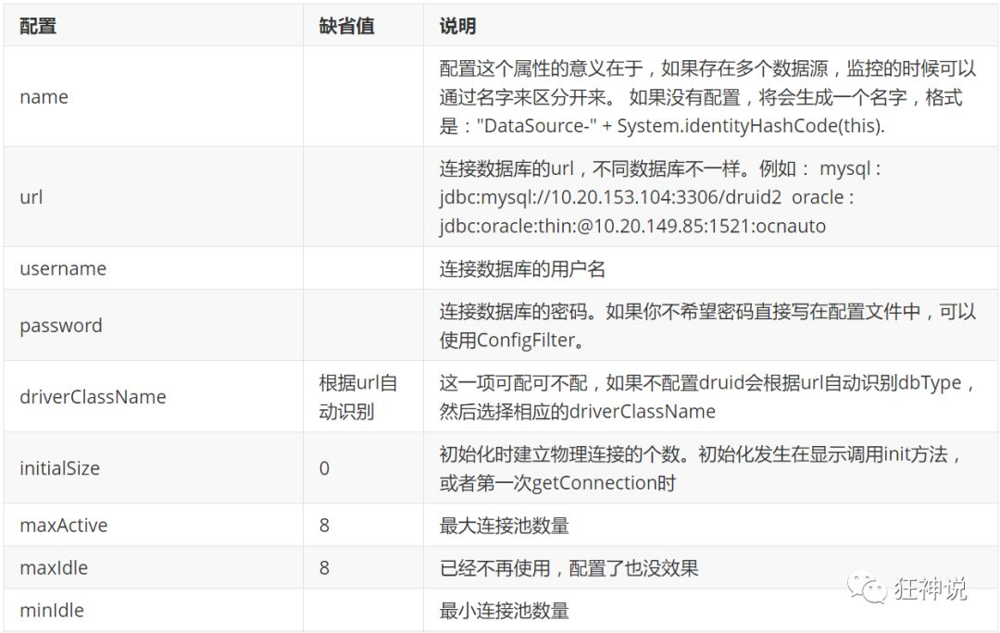
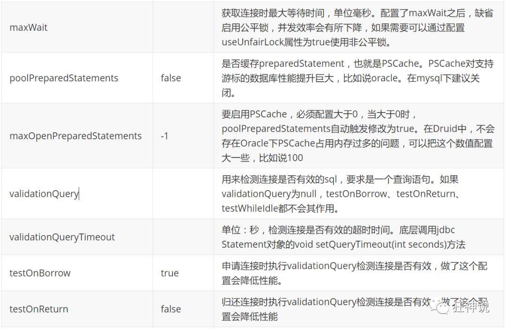
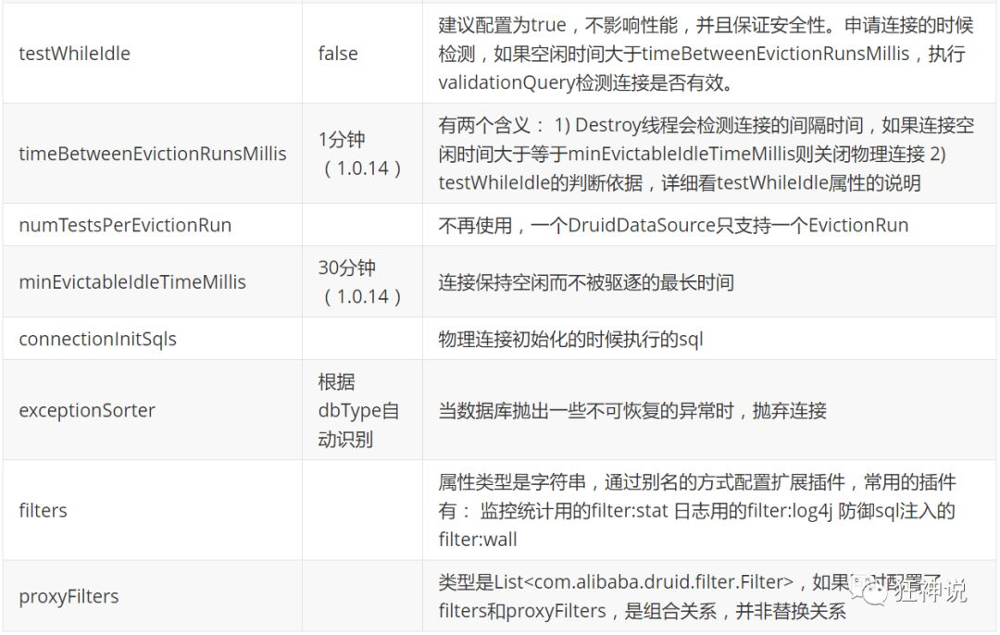
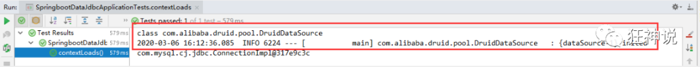
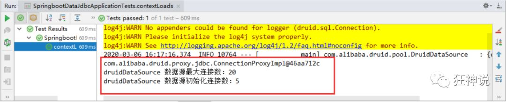
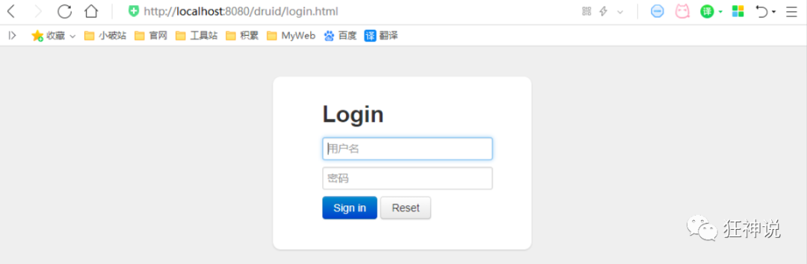
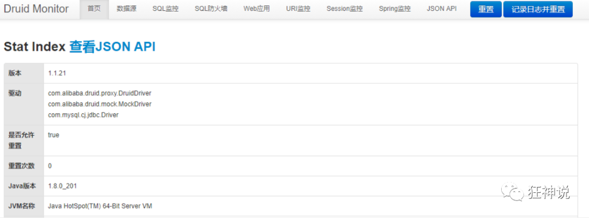
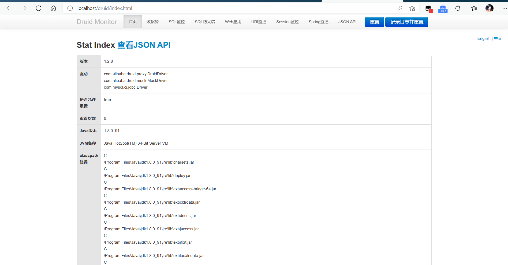
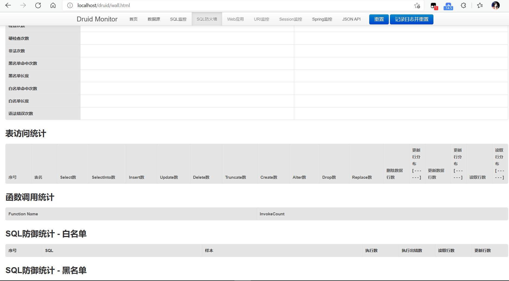

### Druid简介

- Java程序很大一部分要操作数据库，为了提高性能操作数据库的时候，又不得不使用数据库连接池。
- Druid 是阿里巴巴开源平台上一个数据库连接池实现，结合了 C3P0、DBCP 等 DB 池的优点，同时加入了日志监控。
- Druid 可以很好的监控 DB 池连接和 SQL 的执行情况，天生就是针对监控而生的 DB 连接池。
- Druid已经在阿里巴巴部署了超过600个应用，经过一年多生产环境大规模部署的严苛考验。

Spring Boot 2.0 以上默认使用 Hikari 数据源，可以说 Hikari 与 Driud 都是当前 Java Web 上最优秀的数据源，我们来重点介绍 Spring Boot 如何集成 Druid 数据源，如何实现数据库监控。

Github地址：https://github.com/alibaba/druid/

>com.alibaba.druid.pool.DruidDataSource 基本配置参数如下：







### $\textcolor{ProcessBlue}{配置数据源} $

>1、添加上 Druid 数据源依赖。

```xml
<!-- https://mvnrepository.com/artifact/com.alibaba/druid -->
<dependency>    
    <groupId>com.alibaba</groupId>    
    <artifactId>druid</artifactId>    
    <version>1.1.21</version>
</dependency>
```

>2、切换数据源；之前已经说过 Spring Boot 2.0 以上默认使用 com.zaxxer.hikari.HikariDataSource 数据源，但可以 通过 spring.datasource.type 指定数据源。

```yaml
spring:  
    datasource:    
        username: root    
        password: 123456    
        url: jdbc:mysql://localhost:3306/springboot?serverTimezone=UTC&useUnicode=true&characterEncoding=utf-8    
        driver-class-name: com.mysql.cj.jdbc.Driver    
        type: com.alibaba.druid.pool.DruidDataSource # 自定义数据源
```

>3、数据源切换之后，在测试类中注入 DataSource，然后获取到它，输出一看便知是否成功切换；



>4、切换成功！既然切换成功，就可以设置数据源连接初始化大小、最大连接数、等待时间、最小连接数 等设置项；可以查看源码

```yaml
spring:  
    datasource:    
    username: root    
    password: 123456    
    #?serverTimezone=UTC解决时区的报错    
    url: jdbc:mysql://localhost:3306/springboot?serverTimezone=UTC&useUnicode=true&characterEncoding=utf-8    
    driver-class-name: com.mysql.cj.jdbc.Driver    
    type: com.alibaba.druid.pool.DruidDataSource
    
    #Spring Boot 默认是不注入这些属性值的，需要自己绑定    
    #druid 数据源专有配置    
    initialSize: 5    
    minIdle: 5    
    maxActive: 20    
    maxWait: 60000    
    timeBetweenEvictionRunsMillis: 60000    
    minEvictableIdleTimeMillis: 300000    
    validationQuery: SELECT 1 FROM DUAL    
    testWhileIdle: true    
    testOnBorrow: false    
    testOnReturn: false    
    poolPreparedStatements: true
    
    #配置监控统计拦截的filters，stat:监控统计、log4j：日志记录、wall：防御sql注入    
    #如果允许时报错  java.lang.ClassNotFoundException: org.apache.log4j.Priority    
    #则导入 log4j 依赖即可，Maven 地址：https://mvnrepository.com/artifact/log4j/log4j   
    filters: stat,wall,log4j    
    maxPoolPreparedStatementPerConnectionSize: 20    
    useGlobalDataSourceStat: true    
    connectionProperties: druid.stat.mergeSql=true;druid.stat.slowSqlMillis=500
```

>5、导入Log4j 的依赖

```xml
<!-- https://mvnrepository.com/artifact/log4j/log4j -->
<dependency>    
    <groupId>log4j</groupId>    
    <artifactId>log4j</artifactId>    
    <version>1.2.17</version>
</dependency>
```

>6、现在需要程序员自己为 DruidDataSource 绑定全局配置文件中的参数，再添加到容器中，而不再使用 Spring Boot 的自动生成了；我们需要 自己添加 DruidDataSource 组件到容器中，并绑定属性；

```java
package com.kuang.config;
import com.alibaba.druid.pool.DruidDataSource;
import org.springframework.boot.context.properties.ConfigurationProperties;
import org.springframework.context.annotation.Bean;import org.springframework.context.annotation.Configuration;
import javax.sql.DataSource;
@Configuration
public class DruidConfig {
    /*       将自定义的 Druid数据源添加到容器中，不再让 Spring Boot 自动创建       
    绑定全局配置文件中的 druid 数据源属性到 com.alibaba.druid.pool.DruidDataSource从而让它们生效       
    @ConfigurationProperties(prefix = "spring.datasource")：作用就是将 全局配置文件中       
    前缀为 spring.datasource的属性值注入到 com.alibaba.druid.pool.DruidDataSource 的同名参数中     
    */    
    
    @ConfigurationProperties(prefix = "spring.datasource")    
    @Bean    public DataSource druidDataSource() {        
        return new DruidDataSource();    
    }
}
```

>7、去测试类中测试一下；看是否成功！

```java
@SpringBootTestclass SpringbootDataJdbcApplicationTests {
    //DI注入数据源    
    @Autowired    DataSource dataSource;
    
    @Test    
    public void contextLoads() throws SQLException {        
        //看一下默认数据源        
        System.out.println(dataSource.getClass());        
        //获得连接        
        Connection connection =   dataSource.getConnection();        
        System.out.println(connection);
        
        DruidDataSource druidDataSource = (DruidDataSource) dataSource;        
        System.out.println("druidDataSource 数据源最大连接数：" + druidDataSource.getMaxActive());        
        System.out.println("druidDataSource 数据源初始化连接数：" + druidDataSource.getInitialSize());
        //关闭连接        
        connection.close();    
    }
}
```

输出结果 ：可见配置参数已经生效！



$\textcolor{ProcessBlue}{配置Druid数据源监控} $

Druid 数据源具有监控的功能，并提供了一个 web 界面方便用户查看，类似安装 路由器 时，也提供了一个默认的 web 页面。

所以第一步需要设置 Druid 的后台管理页面，比如 登录账号、密码 等；配置后台管理；

```java
//配置 Druid 监控管理后台的Servlet；
//内置 Servlet 容器时没有web.xml文件，所以使用 Spring Boot 的注册 Servlet 方式
@Bean
public ServletRegistrationBean statViewServlet() {    
    ServletRegistrationBean bean = new ServletRegistrationBean(new StatViewServlet(), "/druid/*");
    
    // 这些参数可以在 com.alibaba.druid.support.http.StatViewServlet     
    // 的父类 com.alibaba.druid.support.http.ResourceServlet 中找到    
    Map<String, String> initParams = new HashMap<>();    
    initParams.put("loginUsername", "admin"); //后台管理界面的登录账号    
    initParams.put("loginPassword", "123456"); //后台管理界面的登录密码
    
    //后台允许谁可以访问    
    //initParams.put("allow", "localhost")：表示只有本机可以访问    
    //initParams.put("allow", "")：为空或者为null时，表示允许所有访问    
    initParams.put("allow", "");    
    //deny：Druid 后台拒绝谁访问    
    //initParams.put("kuangshen", "192.168.1.20");表示禁止此ip访问
    //设置初始化参数    
    bean.setInitParameters(initParams);    
    return bean;
}
```

配置完毕后，我们可以选择访问 ：http://localhost:8080/druid/login.html



进入之后




>配置 Druid web 监控 filter 过滤器

```java
//配置 Druid 监控 之  web 监控的 filter
//WebStatFilter：用于配置Web和Druid数据源之间的管理关联监控统计
@Bean
public FilterRegistrationBean webStatFilter() {    
    FilterRegistrationBean bean = new FilterRegistrationBean();    
    bean.setFilter(new WebStatFilter());
    
    //exclusions：设置哪些请求进行过滤排除掉，从而不进行统计    
    Map<String, String> initParams = new HashMap<>();    
    initParams.put("exclusions", "*.js,*.css,/druid/*,/jdbc/*");    
    bean.setInitParameters(initParams);
    //"/*" 表示过滤所有请求    
    bean.setUrlPatterns(Arrays.asList("/*"));    
    return bean;
}
```

平时在工作中，按需求进行配置即可，主要用作监控！


### $\textcolor{ProcessBlue}{Druid和Druid-SpringBoot-Starter在SpringBoot下的使用} $

>一、认识Druid和Druid Spring Boot Starter

1.1  认识Druid

​		Druid是Java语言中最好的数据库连接池。Druid能够提供强大的监控和扩展功能。DruidDataSource支持的数据库：
理论上说，支持所有有jdbc驱动的数据库。

1.2  认识Druid Spring Boot Starter

​		Spring Boot with Druid support,help you simplify Druid config in Spring Boot.

​		Druid Spring Boot Starter 用于帮助你在Spring Boot项目中轻松集成Druid数据库连接池和监控。

>二、Druid在SpringBoot下的使用

2.1  导入依赖

```xml
<!-- https://mvnrepository.com/artifact/com.alibaba/druid -->
<dependency>
    <groupId>com.alibaba</groupId>
    <artifactId>druid</artifactId>
    <version>1.2.8</version>
</dependency>
```

2.2  编写application.yml

```yaml
spring:
  datasource:
    username: root
    password: 123456
    url: jdbc:mysql://localhost:3306/mysql?useUnicode=true&characterEncoding=utf-8&serverTimezone=UTC
    driver-class-name: com.mysql.cj.jdbc.Driver
    type: com.alibaba.druid.pool.DruidDataSource
    #Spring Boot 默认是不注入这些属性值的，需要自己绑定
    #druid 数据源专有配置
    initialSize: 5
    minIdle: 5
    maxActive: 20
    maxWait: 60000
    timeBetweenEvictionRunsMillis: 60000
    minEvictableIdleTimeMillis: 300000
    validationQuery: SELECT 1 FROM DUAL
    testWhileIdle: true
    testOnBorrow: false
    testOnReturn: false
    poolPreparedStatements: true

    #配置监控统计拦截的filters，stat:监控统计、log4j：日志记录、wall：防御sql注入
    #如果允许时报错  java.lang.ClassNotFoundException: org.apache.log4j.Priority
    #则导入 log4j 依赖即可，Maven 地址：https://mvnrepository.com/artifact/log4j/log4j
    filters: stat,wall,log4j
    maxPoolPreparedStatementPerConnectionSize: 20
    useGlobalDataSourceStat: true
    connectionProperties: druid.stat.mergeSql=true;druid.stat.slowSqlMillis=500
```

2.3配置类编写

```java
@Configuration
public class DruidConfig {

    @ConfigurationProperties(prefix = "spring.datasource")
    @Bean
    public DataSource druidDataSource(){
        return new DruidDataSource();
    }
    //后台监控
    @Bean
    public ServletRegistrationBean statViewServlet(){
        ServletRegistrationBean<StatViewServlet> bean = new ServletRegistrationBean<>(new StatViewServlet(), "/druid/*");
        //后台登陆,设置密码账号配置
        HashMap<String,String> initParameters =new HashMap<>();
        //增加配置
        initParameters.put("loginUsername","admin");
        initParameters.put("loginPassword","123456");
        //允许谁可以访问
        initParameters.put("allow","");
        //禁止谁访问initParameters.put("cyfe","192.168.23.113");

        bean.setInitParameters(initParameters);//设置初始化参数
        return bean;
    }

    //filter过滤器
    @Bean
    public FilterRegistrationBean webStatFilter(){
        FilterRegistrationBean bean = new FilterRegistrationBean();
        bean.setFilter(new WebStatFilter());
        //过滤请求
        HashMap<String,String> initParameters =new HashMap<>();
        initParameters.put("exclusions","*.js,*.css,*.img,/druid/*");
        bean.setInitParameters(initParameters);
        return bean;
    }
}
```

2.4访问：http://localhost:8080/druid/



>三、Druid Spring Boot Starter在SpringBoot下的使用

3.1导入依赖

```xml
<!-- https://mvnrepository.com/artifact/com.alibaba/druid-spring-boot-starter -->
<dependency>
    <groupId>com.alibaba</groupId>
    <artifactId>druid-spring-boot-starter</artifactId>
    <version>1.2.8</version>
</dependency>
```

3.2.1编写application.yml

```yml
spring:
  application:
    	name: springboot-test-exam1
  datasource:
        # 使用阿里的Druid连接池
        type: com.alibaba.druid.pool.DruidDataSource
        driver-class-name: com.mysql.jdbc.Driver
        # 填写你数据库的url、登录名、密码和数据库名
        url: jdbc:mysql://localhost:3306/databaseName?useSSL=false&characterEncoding=utf8
        username: root
        password: root
        druid:
              # 连接池的配置信息
              # 初始化大小，最小，最大
              initial-size: 5
              min-idle: 5
              maxActive: 20
              # 配置获取连接等待超时的时间
              maxWait: 60000
              # 配置间隔多久才进行一次检测，检测需要关闭的空闲连接，单位是毫秒
              timeBetweenEvictionRunsMillis: 60000
              # 配置一个连接在池中最小生存的时间，单位是毫秒
              minEvictableIdleTimeMillis: 300000
              validationQuery: SELECT 1
              testWhileIdle: true
              testOnBorrow: false
              testOnReturn: false
              # 打开PSCache，并且指定每个连接上PSCache的大小
              poolPreparedStatements: true
              maxPoolPreparedStatementPerConnectionSize: 20
              # 配置监控统计拦截的filters，去掉后监控界面sql无法统计，'wall'用于防火墙
              filters: stat,wall,slf4j
              # 通过connectProperties属性来打开mergeSql功能；慢SQL记录
              connectionProperties: druid.stat.mergeSql\=true;druid.stat.slowSqlMillis\=5000
              # 配置DruidStatFilter
              web-stat-filter:
                    enabled: true
                    url-pattern: "/*"
                    exclusions: "*.js,*.gif,*.jpg,*.bmp,*.png,*.css,*.ico,/druid/*"
              # 配置DruidStatViewServlet
              stat-view-servlet:
                    url-pattern: "/druid/*"
                    # IP白名单(没有配置或者为空，则允许所有访问)
                    allow: 127.0.0.1,192.168.163.1
                    # IP黑名单 (存在共同时，deny优先于allow)
                    deny: 192.168.1.73
                    #  禁用HTML页面上的“Reset All”功能
                    reset-enable: false
                    # 登录名
                    login-username: admin
                    # 登录密码
                    login-password: 123456
```

3.2.2或者也可以使用application.properties

```properties
server.port=8080
 
spring.application.name=springboot-test-exam1
 
spring.datasource.type=com.alibaba.druid.pool.DruidDataSource
spring.datasource.driver-class-name=com.mysql.jdbc.Driver
spring.datasource.url=jdbc:mysql://localhost:3306/databaseName?useSSL=false&characterEncoding=utf8
spring.datasource.username=root
spring.datasource.password=root
spring.datasource.druid.initial-size=5
spring.datasource.druid.min-idle=5
spring.datasource.druid.maxActive=20
spring.datasource.druid.maxWait=60000
spring.datasource.druid.timeBetweenEvictionRunsMillis=60000
spring.datasource.druid.minEvictableIdleTimeMillis=300000
spring.datasource.druid.validationQuery=SELECT 1 FROM DUAL
spring.datasource.druid.testWhileIdle=true
spring.datasource.druid.testOnBorrow=false
spring.datasource.druid.testOnReturn=false
spring.datasource.druid.poolPreparedStatements=true
spring.datasource.druid.maxPoolPreparedStatementPerConnectionSize=20
spring.datasource.druid.filters=stat,wall,slf4j
spring.datasource.druid.connectionProperties=druid.stat.mergeSql\=true;druid.stat.slowSqlMillis\=5000
spring.datasource.druid.web-stat-filter.enabled=true
spring.datasource.druid.web-stat-filter.url-pattern=/*
spring.datasource.druid.web-stat-filter.exclusions=*.js,*.gif,*.jpg,*.bmp,*.png,*.css,*.ico,/druid/*
spring.datasource.druid.stat-view-servlet.url-pattern=/druid/*
spring.datasource.druid.stat-view-servlet.allow=127.0.0.1,192.168.163.1
spring.datasource.druid.stat-view-servlet.deny=192.168.1.73
spring.datasource.druid.stat-view-servlet.reset-enable=false
spring.datasource.druid.stat-view-servlet.login-username=admin
spring.datasource.druid.stat-view-servlet.login-password=123456
```

3.3访问：[http://localhost:8080/druid](http://localhost:8080/druid/)

