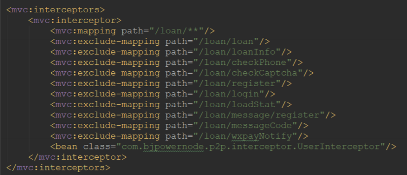

### 一、回顾 SpringMVC 使用拦截器步骤

>1、自定义拦截器类，实现 HandlerInterceptor 接口 

```java
public class UserInterceptor implements HandlerInterceptor {
    @Override
    public boolean preHandle(HttpServletRequest request,
                             HttpServletResponse response, Object handler) throws Exception {
        //编写登录拦截业务逻辑
        //返回 true 通过
        //返回 false 被拦截
        System.out.println("--------登录拦截器---------");
        return true;
    }
    @Override
    public void postHandle(HttpServletRequest request,
                           HttpServletResponse response, Object handler, ModelAndView modelAndView)
            throws Exception {
    }
    @Override
    public void afterCompletion(HttpServletRequest request,
                                HttpServletResponse response, Object handler, Exception ex) throws
            Exception {
    }
}
```

>2、注册拦截器类



### 二、Spring Boot 使用拦截器步骤

>1、自定义拦截器类，实现 HandlerInterceptor 接口 ，并加入Spring容器中（@Component）

```java
@Component
public class UserInterceptor implements HandlerInterceptor {
    
    /**
     * 预处理回调方法，实现处理器的预处理
     * 返回值：true表示继续流程；false表示流程中断，不会继续调用其他的拦截器或处理器
   */
    @Override
    public boolean preHandle(HttpServletRequest request,
                             HttpServletResponse response, Object handler) throws Exception {
        //编写登录拦截业务逻辑
        //返回 true 通过
        //返回 false 被拦截
        System.out.println("--------登录拦截器---------");
        return true;
    }
    
    /**
     * 后处理回调方法，实现处理器（controller）的后处理，但在渲染视图之前
     * 此时我们可以通过modelAndView对模型数据进行处理或对视图进行处理
     */
    @Override
    public void postHandle(HttpServletRequest request,
                           HttpServletResponse response, Object handler, ModelAndView modelAndView)
            throws Exception {
    }
    
    /**
     * 整个请求处理完毕回调方法，即在视图渲染完毕时回调，
     * 如性能监控中我们可以在此记录结束时间并输出消耗时间，
     * 还可以进行一些资源清理，类似于try-catch-finally中的finally，
     * 但仅调用处理器执行链中
     */
    @Override
    public void afterCompletion(HttpServletRequest request,
                                HttpServletResponse response, Object handler, Exception ex) throws
            Exception {
    }
}
```

>2、在 项 目 中 创 建 一 个 config 包 ， 创 建 一 个 配 置 类 InterceptorConfig ， 并 实 现 WebMvcConfigurer 接口， 覆盖接口中的 addInterceptors 方法，并为该配置类添加 @Configuration 注解，标注此类为一个配置类，让 Spring Boot 扫描到，这里的操作就相当 于 SpringMVC 的注册拦截器 ，@Configuration 就相当于一个 applicationContext-mvc.xml

```java
@Configuration //用于定义配置类，可替换 xml 文件；定义一个拦截器，相当于之前的mvc 里的配置
public class InterceptorConfig implements WebMvcConfigurer {
    
    @Autowired
    private UserInterceptor userInterceptor;
    
    @Override
    public void addInterceptors(InterceptorRegistry registry) {
        //定义需要拦截的路径
        String[] addPathPatterns = {
                "/user/**",
        };
        //定义不需要拦截的路径
        String[] excludePathPatterns = {
                "/user/error",
                "/user/verifyRealName"
        };
        registry.addInterceptor(userInterceptor) //添加要注册的拦截器对象
                .addPathPatterns(addPathPatterns) //添加需要拦截的路径
                .excludePathPatterns(excludePathPatterns); //添加不需要拦截的路径
    }
}
```

