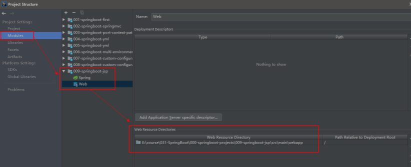

### $\textcolor{ProcessBlue}{Spring Boot 集成JSP} $

>**一、**在 pom.xml 文件中配置以下依赖项

```xml
<!--引入 Spring Boot 内嵌的 Tomcat 对 JSP 的解析包，不加解析不了 jsp 页面-->
<!--如果只是使用 JSP 页面，可以只添加该依赖-->
<dependency>
    <groupId>org.apache.tomcat.embed</groupId>
    <artifactId>tomcat-embed-jasper</artifactId>
</dependency>
<!--如果要使用 servlet 必须添加该以下两个依赖-->
<!-- servlet 依赖的 jar 包-->
<dependency>
    <groupId>javax.servlet</groupId>
    <artifactId>javax.servlet-api</artifactId>
</dependency>
<dependency>
    <groupId>javax.servlet.jsp</groupId>
    <artifactId>javax.servlet.jsp-api</artifactId>
    <version>2.3.1</version>
</dependency>
<!--如果使用 JSTL 必须添加该依赖-->
<!--jstl 标签依赖的 jar 包 start-->
<dependency>
    <groupId>javax.servlet</groupId>
    <artifactId>jstl</artifactId>
</dependency>
```

>二、在 pom.xml 的 build 标签中配置以下信息

SpringBoot 要求 jsp 文件必须编译到指定的 META-INF/resources 目录下才能访问，否则访问不到。其实官方已经更建议使用模板技术。

```xml
<!--SpringBoot 要求 jsp 文件必须编译到指定的 META-INF/resources 目录下才能访问，否则访问不到。-->
<resources>
    <resource>
        <!--源文件位置-->
        <directory>src/main/webapp</directory>
        <!--指定编译到 META-INF/resources，该目录不能随便写-->
        <targetPath>META-INF/resources</targetPath>
        <!--指定要把哪些文件编译进去，**表示 webapp 目录及子目录，*.*表示所有文件-->
        <includes>
            <include>**/*.*</include>
        </includes>
    </resource>
</resources>
```

>三、在 application.properties 文件配置 Spring MVC 的视图展示为 jsp，这里相当于 Spring MVC 的配置

```properties
#配置 SpringMVC 视图解析器 
#其中：/ 表示目录为 src/main/webapp 
spring.mvc.view.prefix=/WEB-INF/     #jsp页面放在web-inf文件夹下比较安全
spring.mvc.view.suffix=.jsp
```

>四、在 src/main 下创建一个 webapp 目录，然后在该目录下新建 index.jsp 页面

如果在webapp目录下右键，没有创建jsp的选项，可以在Project Structure中指定webapp 为 Web Resource Directory



>五、SpringBoot修改jsp后重启问题解决

解决方案如下 

在配置文件application.properties中添加如下配置：

```properties
# 1.5版本：
server.jsp-servlet.init-parameters.development=true
# 2.0版本：
server.servlet.jsp.init-parameters.development=true
```

