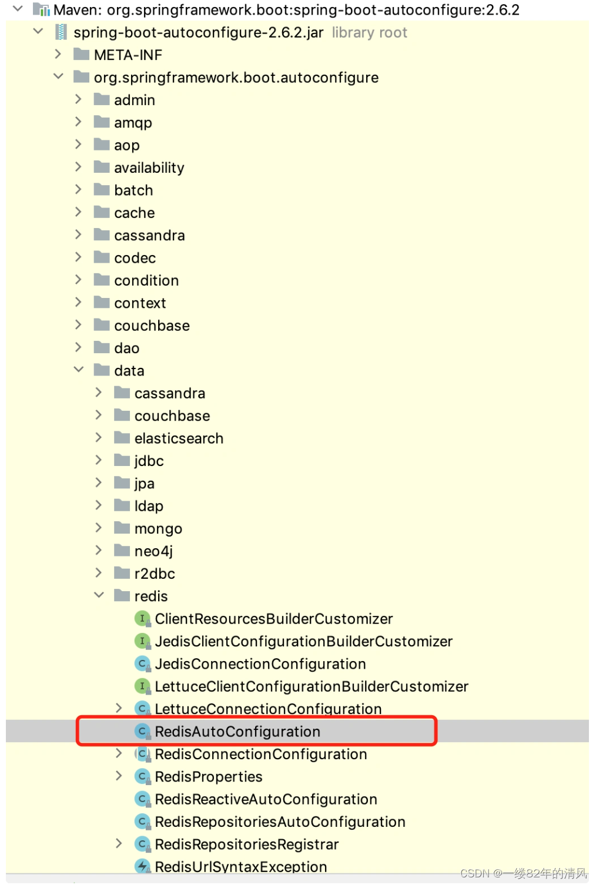
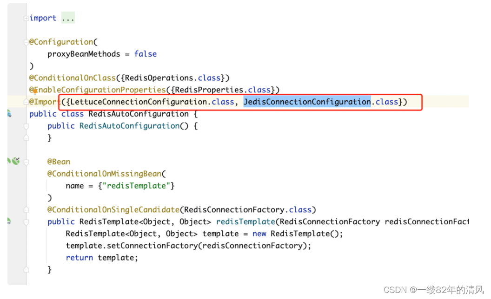
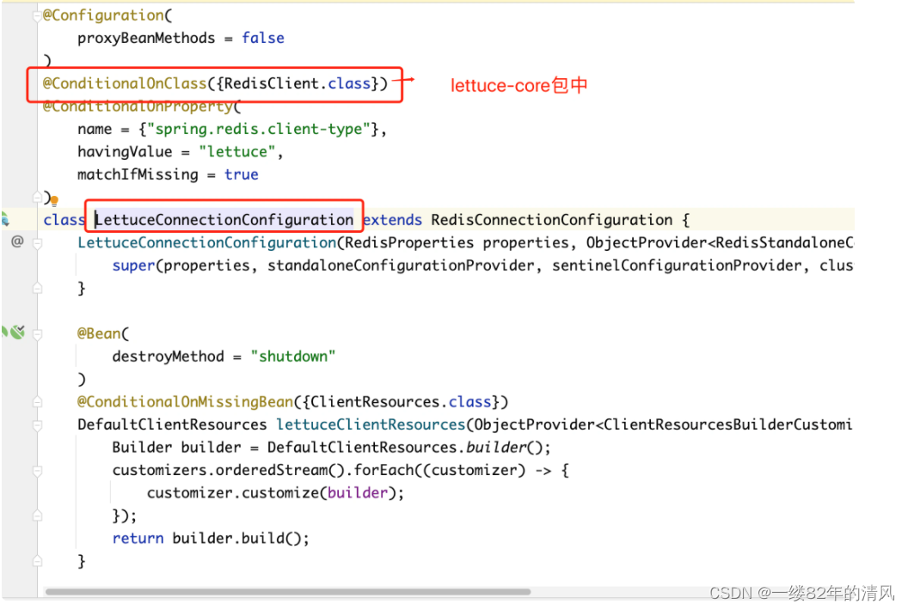
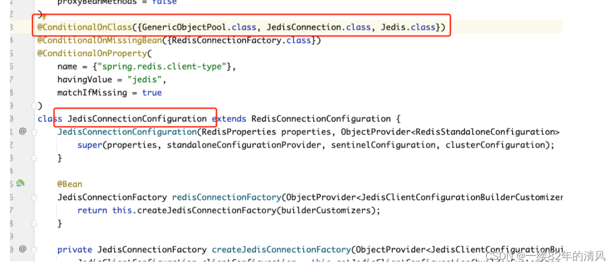
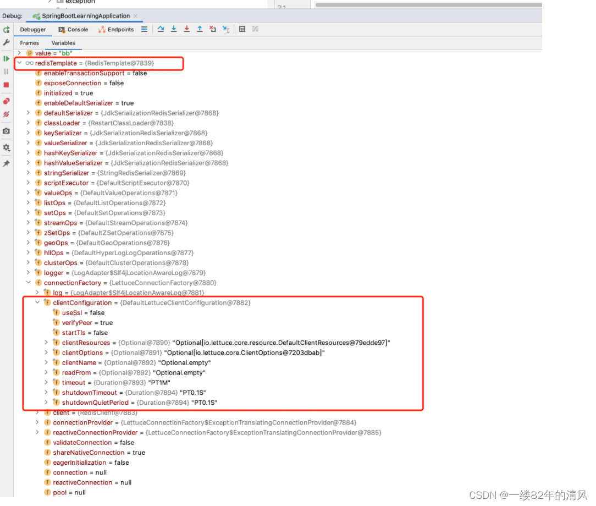
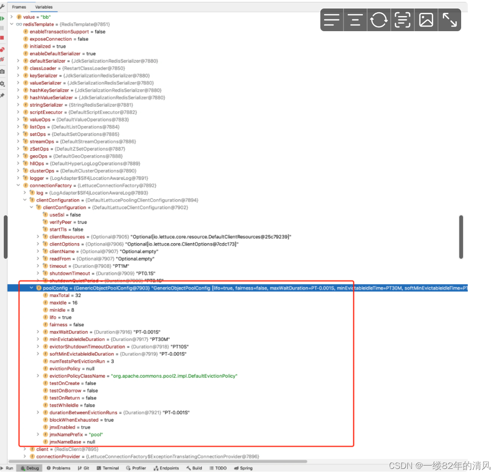
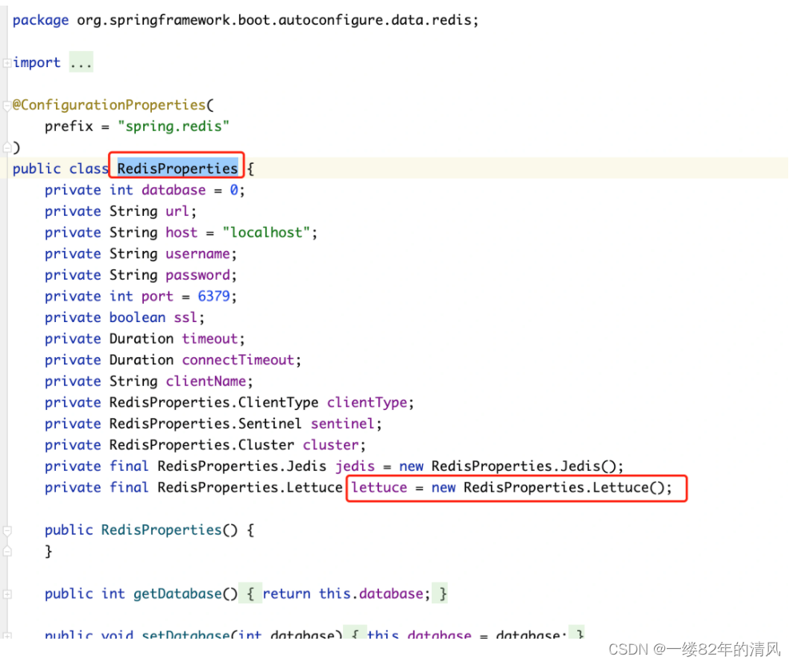
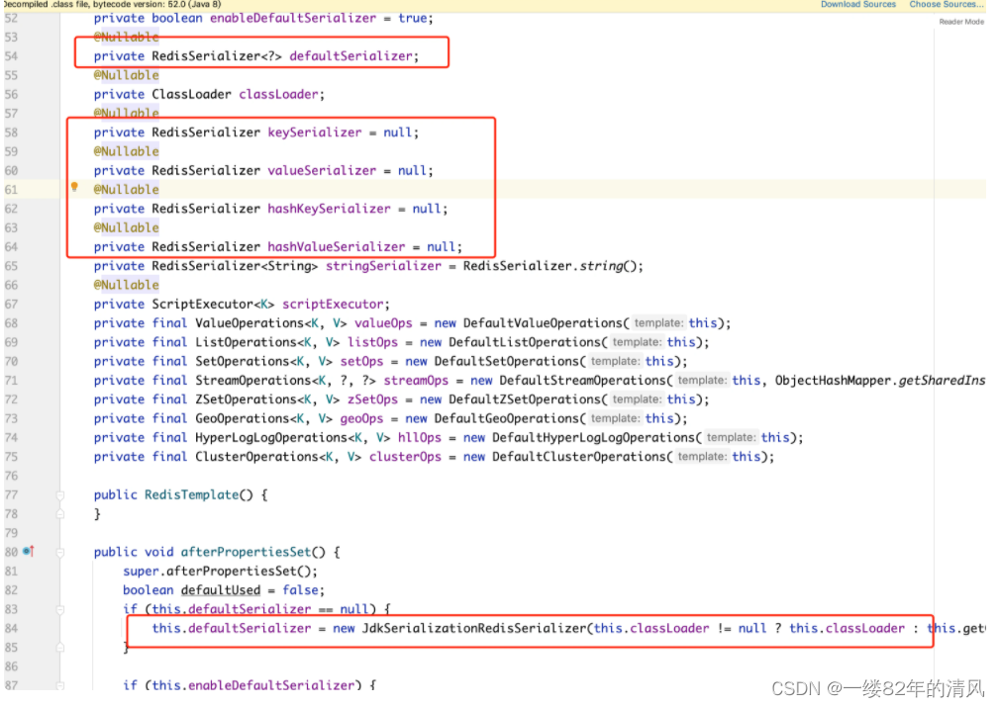

### $\textcolor{ProcessBlue}{一、Redis集成简介} $

​		Redis是我们Java开发中，使用频次非常高的一个nosql数据库，数据以key-value键值对的形式存储在内存中。redis的常用使用场景，可以做缓存，分布式锁，自增序列等，使用redis的方式和我们使用数据库的方式差不多，首先我们要在自己的本机电脑或者服务器上安装一个redis的服务器，通过我们的java客户端在程序中进行集成，然后通过客户端完成对redis的增删改查操作。redis的Java客户端类型还是很多的，常见的有jedis, redission,lettuce等，所以我们在集成的时候，我们可以选择直接集成这些原生客户端。但是在springBoot中更常见的方式是集成spring-data-redis，这是spring提供的一个专门用来操作redis的项目，封装了对redis的常用操作，里边主要封装了jedis和lettuce两个客户端。相当于是在他们的基础上加了一层门面。

本篇文章我们就来重点介绍，springBoot通过集成spring-data-redis使用对于redis的常用操作。

### $\textcolor{ProcessBlue}{二、集成步骤} $

>2.1 添加依赖

添加redis所需依赖：

```xml
<!-- 集成redis依赖  -->
    <dependency>
    <groupId>org.springframework.boot</groupId>
    <artifactId>spring-boot-starter-data-redis</artifactId>
</dependency>
```

这里我们直接引入了spring-boot-starter-data-redis这个springBoot本身就已经提供好了的starter, 我们可以点击去看一下这个starter中包含了哪些依赖：

```xml
<dependencies>
      <dependency>
            <groupId>org.springframework.boot</groupId>
            <artifactId>spring-boot-starter</artifactId>
            <version>2.7.2</version>
            <scope>compile</scope>
      </dependency>
      <dependency>
            <groupId>org.springframework.data</groupId>
            <artifactId>spring-data-redis</artifactId>
            <version>2.7.2</version>
            <scope>compile</scope>
      </dependency>
      <dependency>
            <groupId>io.lettuce</groupId>
            <artifactId>lettuce-core</artifactId>
            <version>6.1.9.RELEASE</version>
            <scope>compile</scope>
      </dependency>
</dependencies>
```

可以发现，里面包含了spring-data-redis和 lettuce-core两个核心包，这就是为什么说我们的spring-boot-starter-data-redis默认使用的就是lettuce这个客户端了。

如果我们想要使用jedis客户端怎么办呢？就需要排除lettuce这个依赖，再引入jedis的相关依赖就可以了。

那么为什么我们只需要通过引入不同的依赖就能让spring-data-redis可以自由切换客户端呢，这其实就涉及到了springBoot的自动化配置原理。我们可以给大家简单讲解一下。

springBoot这个框架之所以可以通过各种starter无缝融合其他技术的一大主要原因就是springBoot本身的自动化配置功能。所谓自动化配置就是springBoot本身已经预先设置好了一些常用框架的整合类。然后通过类似于ConditionOn这样的条件判断注解，去辨别你的项目中是否有相关的类（或配置）了，进而进行相关配置的初始化。

springBoot预设的自动化配置类都位于spring-boot-autoconfigure这个包中，只要我们搭建了springBoot的项目，这个包就会被引入进来。



而这个包下就有一个RedisAutoConfiguration这个类，顾名思义就是Redis的自动化配置。在这个类中，会引入LettuceConnectionConfiguration 和 JedisConnectionConfiguration 两个配置类，分别对应lettuce和jedis两个客户端。



而这个两个类上都是用了ConditionOn注解来进行判断是否加载。



jedis如下；



而由于我们的项目自动引入了lettuce-core，而没有引入jedis相关依赖，所以LettuceConnectionConfiguration这个类的判断成立会被加载，而Jedis的判断不成立，所以不会加载。进而lettuce的配置生效，所以我们在使用的使用， 默认就是lettuce的客户端。

>2.2 添加配置

然后我们需要配置连接redis所需的账号密码等信息，这里大家要提前安装好redis,保证我们的本机程序可以连接到我们的redis， 如果不知道redis如何安装，可以参考文章: [Linux系统安装redis6.0.5] https://blog.csdn.net/lsqingfeng/article/details/107359076

常规配置如下： 在application.yml配置文件中配置 redis的连接信息

```yaml
spring:
  	redis:
        host: localhost
        port: 6379
        password: 123456
        database: 0
```

这样我们就可以直接在项目当中操作redis了。如果使用的是集群，那么使用如下配置方式：

```yaml
spring:
    redis:
        password: 123456
        cluster:
            nodes: 10.255.144.115:7001,10.255.144.115:7002,10.255.144.115:7003,10.255.144.115:7004,10.255.144.115:7005,10.255.144.115:7006
            max-redirects: 3
```

但是有的时候我们想要给我们的redis客户端配置上连接池。就像我们连接mysql的时候，也会配置连接池一样，目的就是增加对于数据连接的管理，提升访问的效率，也保证了对资源的合理利用。那么我们如何配置连接池呢，这里大家一定要注意了，很多网上的文章中，介绍的方法可能由于版本太低，都不是特别的准确。 比如很多人使用spring.redis.pool来配置，这个是不对的（不清楚是不是老版本是这样的配置的，但是在springboot-starter-data-redis中这种写法不对）。首先是配置文件，由于我们使用的lettuce客户端，所以配置的时候，在spring.redis下加上lettuce再加上pool来配置，具体如下；

```yaml
spring:
    redis:
        host: 10.255.144.111
        port: 6379
        password: 123456
        database: 0
        lettuce:
            pool:
                max-idle: 16
                max-active: 32
                min-idle: 8
```

如果使用的是jedis,就把lettuce换成jedis（同时要注意依赖也是要换的）。

但是仅仅这在配置文件中加入，其实连接池是不会生效的。这里大家一定要注意，很多同学在配置文件上加上了这段就以为连接池已经配置好了，其实并没有，还少了最关键的一步，就是要导入一个依赖，不导入的话，这么配置也没有用。

```xml
<dependency>
    <groupId>org.apache.commons</groupId>
    <artifactId>commons-pool2</artifactId>
</dependency>
```

之后，连接池才会生效。我们可以做一个对比。 在导包前后，观察RedisTemplate对象的值就可以看出来。





具体的配置信息我们可以看一下源代码，源码中使用RedisProperties 这个类来接收redis的配置参数。



>2.3 项目中使用

我们的配置工作准备就绪以后，我们就可以在项目中操作redis了，操作的话，使用spring-data-redis中为我们提供的 RedisTemplate 这个类，就可以操作了。我们先举个简单的例子，插入一个键值对（值为string）。

```java
package com.lsqingfeng.springboot.controller;
import com.lsqingfeng.springboot.base.Result;
import org.springframework.data.redis.core.RedisTemplate;
import org.springframework.web.bind.annotation.GetMapping;
import org.springframework.web.bind.annotation.RequestMapping;
import org.springframework.web.bind.annotation.RestController;
/**
@className: RedisController

@description:

@author: sh.Liu

@date: 2022-03-08 14:28
*/
@RestController
@RequestMapping("redis")
public class RedisController {
    
     private final RedisTemplate redisTemplate;
     
     public RedisController(RedisTemplate redisTemplate) {
        this.redisTemplate = redisTemplate;
    }
    
    @GetMapping("save")
    public Result save(String key, String value){
        redisTemplate.opsForValue().set(key, value);
        return Result.success();
    }
}
```

### $\textcolor{ProcessBlue}{三、讲讲序列化} $

​		redis的序列化也是我们在使用RedisTemplate的过程中需要注意的事情。上面的案例中，其实我们并没有特殊设置redis的序列化方式，那么它其实使用的是默认的序列化方式。RedisTemplate这个类的泛型是,也就是他是支持写入Object对象的，那么这个对象采取什么方式序列化存入内存中就是它的序列化方式。

​		那么什么是redis的序列化呢？就是我们把对象存入到redis中到底以什么方式存储的，可以是二进制数据，可以是xml也可以是json。比如说我们经常会将POJO 对象存储到 Redis 中，一般情况下会使用 JSON 方式序列化成字符串，存储到 Redis 中 。

Redis本身提供了以下序列化的方式：

1. GenericToStringSerializer: 可以将任何对象泛化为字符串并序列化
2. Jackson2JsonRedisSerializer: 跟JacksonJsonRedisSerializer实际上是一样的
3. JacksonJsonRedisSerializer: 序列化object对象为json字符串
4. JdkSerializationRedisSerializer: 序列化java对象
5. StringRedisSerializer: 简单的字符串序列化

如果我们存储的是String类型，默认使用的是StringRedisSerializer 这种序列化方式。如果我们存储的是对象，默认使用的是 JdkSerializationRedisSerializer，也就是Jdk的序列化方式（通过ObjectOutputStream和ObjectInputStream实现，缺点是我们无法直观看到存储的对象内容）。

我们可以根据redis操作的不同数据类型，设置对应的序列化方式。



通过观察RedisTemplate的源码我们就可以看出来，默认使用的是JdkSerializationRedisSerializer. 这种序列化最大的问题就是存入对象后，我们很难直观看到存储的内容，很不方便我们排查问题：

而一般我们最经常使用的对象序列化方式是： Jackson2JsonRedisSerializer

设置序列化方式的主要方法就是我们在配置类中，自己来创建RedisTemplate对象，并在创建的过程中指定对应的序列化方式。

```java
import com.fasterxml.jackson.annotation.JsonAutoDetect;
import com.fasterxml.jackson.annotation.PropertyAccessor;
import com.fasterxml.jackson.databind.ObjectMapper;
import org.springframework.context.annotation.Bean;
import org.springframework.context.annotation.Configuration;
import org.springframework.data.redis.connection.RedisConnectionFactory;
import org.springframework.data.redis.core.RedisTemplate;
import org.springframework.data.redis.serializer.Jackson2JsonRedisSerializer;
import org.springframework.data.redis.serializer.StringRedisSerializer;

@Configuration
public class RedisConfig {
    
    @Bean(name = "redisTemplate")
    public RedisTemplate<String, Object> redisTemplate(RedisConnectionFactory redisConnectionFactory){

        RedisTemplate<String, Object> redisTemplate = new RedisTemplate<>();
        //参照StringRedisTemplate内部实现指定序列化器
        redisTemplate.setConnectionFactory(redisConnectionFactory);
        redisTemplate.setKeySerializer(keySerializer());
        redisTemplate.setHashKeySerializer(keySerializer());
        redisTemplate.setValueSerializer(valueSerializer());
        redisTemplate.setHashValueSerializer(valueSerializer());
        return redisTemplate;
    }

    private RedisSerializer<String> keySerializer(){
        return new StringRedisSerializer();
    }

    //使用Jackson序列化器
    private RedisSerializer<Object> valueSerializer(){
        return new GenericJackson2JsonRedisSerializer();
    }
    
}
```

```java
import com.fasterxml.jackson.annotation.JsonAutoDetect;
import com.fasterxml.jackson.annotation.PropertyAccessor;
import com.fasterxml.jackson.databind.ObjectMapper;
import org.springframework.context.annotation.Bean;
import org.springframework.context.annotation.Configuration;
import org.springframework.data.redis.connection.RedisConnectionFactory;
import org.springframework.data.redis.core.RedisTemplate;
import org.springframework.data.redis.serializer.Jackson2JsonRedisSerializer;
import org.springframework.data.redis.serializer.StringRedisSerializer;

@Configuration
public class RedisConfig {
    
    @Bean(name = "redisTemplate")
    public RedisTemplate<String, Object> redisTemplate(RedisConnectionFactory redisConnectionFactory){
	    RedisTemplate<Object, Object> redisTemplate = new RedisTemplate<>();
        redisTemplate.setConnectionFactory(connectionFactory);

        // 使用Jackson2JsonRedisSerialize替换默认序列化
        Jackson2JsonRedisSerializer jackson2JsonRedisSerializer = new Jackson2JsonRedisSerializer(Object.class);

        ObjectMapper objectMapper = new ObjectMapper();
        objectMapper.setVisibility(PropertyAccessor.ALL, JsonAutoDetect.Visibility.ANY);
        objectMapper.enableDefaultTyping(ObjectMapper.DefaultTyping.NON_FINAL);

        jackson2JsonRedisSerializer.setObjectMapper(objectMapper);

        // 设置key和value的序列化规则
        redisTemplate.setKeySerializer(new StringRedisSerializer());
        redisTemplate.setValueSerializer(jackson2JsonRedisSerializer);
        redisTemplate.setHashKeySerializer(jackson2JsonRedisSerializer);
        redisTemplate.setHashValueSerializer(jackson2JsonRedisSerializer);
        redisTemplate.afterPropertiesSet();

        return redisTemplate;
    }
    
}
```

这样使用的时候，就会按照我们设置的json序列化方式进行存储，我们也可以在redis中查看内容的时候方便的查看到属性值。